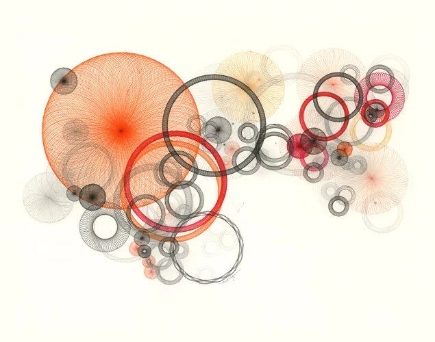

# Orbital linework constellation — primary visual reference

## Status and role

This image is a primary behavioral reference for a distinct Day Objects visual
family called **Linework Constellation**. It demonstrates how many circular and
circle-derived forms can coexist without becoming a random catalog of shapes.

It is not a pixel-perfect target and it does not prescribe exact colors,
coordinates, object counts, or a specific spirograph equation. Preserve its
relationships:

- one strong circular anchor generates a long, tapering field of related forms;
- filled discs, open rings, radial thread bodies, arcs, loops, and ghost circles
  remain members of one circular universe;
- actors connect through overlap, nesting, threading, tangency, and visual echo;
- line density, contour weight, transparency, and scale establish depth;
- a large amount of open background makes the dense chain feel intentional;
- color is restrained and role-based, allowing structure to remain legible;
- complexity grows locally around a flow spine instead of filling the canvas
  uniformly.

Use this reference when designing or reviewing a line-led Day Objects day. Do
not combine its complete shape vocabulary with the complete saturated gradient
vocabulary from `materials/02-editorial-gradient-overlap-reference.md` in one
scene. Each day should retain one primary material DNA.

Apply the shared seed hierarchy, actor identity, compatibility, mutation
budget, and `SceneRecipe` boundary from
[`Day Objects Generative DNA`](../system/01-generative-dna.md). This document
defines the family-specific linework, topology, interaction, and composition
behavior.

## First perceptual read

The image reads as a constellation or current traveling from a large origin
toward a lighter, more fragmented destination. The large anchor on one side is
the first focal point. From it, a chain of rings and small nodes curves across
the field, repeatedly tightening and relaxing before dissolving into pale
structures.

The viewer does not initially count circles. The first read is a single gesture:
origin, transit, clusters, and dissipation. Individual objects become visible
only on a second look.

This distinction is essential. A successful implementation must create one
continuous editorial composition, not a diagram containing dozens of unrelated
ring icons.

## Core visual idea

The family is based on **circular topology under mutation**. Every member can
be understood as a transformation of a circle:

- filled or translucent body;
- perimeter only;
- multiple perimeters;
- missing perimeter segment;
- perimeter woven from many fine lines;
- circle containing a smaller circular void;
- circle orbited by smaller circles;
- circle intersected or threaded by another circle;
- radial line field converging toward an offset or central core.

Variation should come from a controlled subset of these mutations, not from
introducing unrelated polygons, symbols, flowers, stars, or pictograms.

## Composition grammar

### Flow spine

The composition is organized around an invisible curved spine. Major objects
sit on, cross, or orbit this path. Secondary objects gather around it, while
ghost structures extend beyond it to keep the field atmospheric.

The spine should not be rendered as a literal line. It is inferred from:

- successive actor centers;
- changes in scale;
- repeated tangencies;
- overlapping ring boundaries;
- the direction in which clusters become denser or lighter.

For a portrait canvas, the same principle may become a diagonal or vertical
curve. Do not squeeze the original horizontal arrangement into portrait
coordinates. Preserve the gesture, not its orientation.

### Anchor, chain, and satellites

The hierarchy has three compositional roles:

1. **Anchor** — one dominant body or line field that establishes scale and
   direction.
2. **Chain** — several medium circular actors that transmit visual energy away
   from the anchor.
3. **Satellites** — small rings, nodes, arcs, and pale echoes that articulate
   gaps and complete local clusters.

Not every generated scene requires exactly one anchor, but it must have a clear
weight hierarchy. Two anchors are acceptable when one remains secondary. Three
equally dominant circles will usually flatten the composition into a row.

### Tapering density

The reference moves from a large, dense origin toward smaller and more
transparent forms. This produces direction without arrows or literal motion
lines.

Tapering may be expressed through any combination of:

- decreasing diameter;
- thinner contours;
- lower opacity;
- fewer internal threads;
- larger spacing between clusters;
- increasing use of incomplete or ghost forms.

Do not apply all parameters as one mechanical linear ramp. Some local rebounds
in size or density are necessary to avoid a predictable sequence.

### Clusters and intervals

The composition alternates between dense knots and quieter bridges. A cluster
may contain a large ring, a nested smaller ring, one filled node, and several
ghost echoes. A bridge may contain only two touching rings or a faint arc.

This alternating rhythm is more important than uniformly covering the canvas.
Avoid equal spacing and repeated groups with the same internal structure.

### Negative space

Large open regions surround the circular current. Negative space is not unused
area; it gives the chain direction, scale, and delicacy.

For this family, the occupied visual band may use roughly 35–60% of the canvas
while the remainder stays calm. This is intentionally much more open than the
dense gradient-overlap reference.

Avoid placing small decorative circles throughout every empty region. A few
satellites may enter the open field, but the main void must remain legible.

### Canvas boundaries

The source composition is mostly contained inside the canvas rather than being
dominated by edge crops. A Day Objects adaptation may crop one anchor or a few
ghost circles, but edge cropping is not the primary depth device for this
family.

Use cropping selectively. The constellation should feel as though it travels
through the frame, not as though the frame accidentally cut apart a diagram.

## Scale and count

The reference contains many visible circular marks, but visible marks must not
be confused with independent happenings.

A primary actor may contain internal contours, orbiting rings, or a woven
perimeter as part of one stable material identity. These sub-elements are not
additional events. This keeps happening count meaningful and prevents an event
with a detailed material from being counted as ten separate objects.

For a ten-happening scene, a useful starting structure is:

- one large anchor actor;
- two or three medium chain actors;
- three or four small support actors;
- one or two tiny terminal accents.

Internal rings and threads may make the scene appear richer without violating
the ten-actor limit.

The diameter spectrum should be strongly unequal. Avoid a field of identical
medium rings.

## Shape vocabulary

### Radial thread disc

A circular body constructed from many fine lines that converge, cross, or
orbit around a core.

- The outer silhouette remains circular.
- Density may increase near the center, perimeter, or selected crossing zones.
- Individual lines are subordinate to the complete field at normal viewing
  distance.
- The center may be darker because many threads accumulate there, but must not
  read as a pupil, literal hole, or pasted-on dot.
- The line pattern may suggest volume or vibration without becoming a flower.

This construction is suitable for an anchor because it carries visual weight
without requiring a solid opaque fill.

### Woven annulus

A ring whose body is made from repeated fine loops or closely spaced curved
lines.

- It has a readable central opening.
- The ring body contains directional texture.
- Density changes smoothly around the circumference.
- The weave must remain stable at phone resolution and during motion.
- It must not resemble a toothed gear or decorative rosette.

### Heavy contour ring

A simple circular contour with substantial weight.

- Used as a structural connector or focal counterweight.
- May pass in front of and behind other actors through controlled draw order.
- Should appear in a limited range of weights within one scene.
- Multiple heavy rings must not form a regular chain-link pattern.

### Hairline ring

A thin, elegant contour that provides scale contrast and visual continuity.

- Best used for bridges, echoes, and small satellites.
- Must remain visible on both full-screen and calendar-tile backgrounds.
- Opacity may vary, but line width should not fall below reliable rasterization
  at target resolution.
- Several hairlines may overlap, provided they do not create flickering moiré.

### Nested ring system

Two or more circular contours sharing or nearly sharing a center.

- Centers should be close but not mechanically identical in every actor.
- Radius intervals may be irregular.
- One contour may be heavier or more chromatic than the others.
- Nesting should clarify hierarchy, not merely decorate an empty center.

### Incomplete arc

A circular perimeter with one or more missing sections.

- The implied circle remains obvious.
- Openings can point toward a neighboring actor or along the flow spine.
- Arc endpoints must be soft or deliberate, not look like clipping errors.
- Avoid using repeated identical arc lengths and rotations.

### Ghost circle

A low-opacity circle, ring, or thread field used to extend depth and atmosphere.

- It supports a cluster without competing with its anchor.
- It can sit partially behind several actors.
- It should remain perceptible without becoming a gray stain.
- Ghost forms are supporting depth layers, not a separate primary material
  family.

### Filled node

A small filled or softly shaded disc that punctuates a line-led cluster.

- Used sparingly to create density contrast.
- May mark a crossing, terminal point, or local center of gravity.
- Must not appear at every ring intersection.
- Should not become a repeated bead pattern.

### Orbital companion

A small ring or node positioned near the perimeter of a larger actor.

- Its relationship should read as orbit, attachment, or echo.
- It must have its own stable placement and scale.
- Companions should not repeat at the same angle for every actor.
- A companion belongs to the parent material identity unless it represents an
  independent happening.

## Interaction grammar

The actors are defined as much by their relationships as by their individual
construction.

### Overlap

Contours and thread fields may cross visibly. Overlap should reveal draw order
without requiring shadows. Thin transparent lines can accumulate into darker
regions where structures meet.

Avoid filling every overlap with an opaque patch. The source derives richness
from accumulated line density.

### Nesting

A smaller ring may sit inside a larger ring or thread body. Nesting creates a
local hierarchy and can connect a satellite to an anchor.

The inner form should not always be centered. Slight displacement keeps the
relationship organic and prevents a target or eye appearance.

### Threading

One contour may appear to pass through another ring or cluster. This requires
intentional draw-order changes across the interaction rather than simply
drawing one complete circle over another.

Use threading sparingly as a high-information relationship. Too many woven
intersections create an unreadable knot.

### Tangency

Two circles may touch or nearly touch at one point. Tangency can transmit the
flow spine between actors, but repeated perfect tangencies look mechanically
constructed.

Mix direct contact with small gaps and substantial overlaps.

### Echo

A pale or smaller circle can repeat the position, radius, or orientation of a
stronger neighboring form. Echo establishes kinship and depth.

An echo must change at least two properties such as scale, opacity, contour
weight, completeness, or internal density. Exact duplicates look like rendering
artifacts.

### Bridging

A medium or faint actor may span the interval between two denser clusters.
Bridges keep the constellation continuous without filling the complete gap.

### Accumulation nodes

Where several circles meet, transparent contours and thread fields may create a
darker local node. The node should emerge from compositing, not from adding an
unrelated black spot.

## Layering and transparency

Transparency is the main compositing mechanism in this family.

- Fine lines remain individually translucent.
- Dense crossings become stronger through accumulation.
- Ghost forms recede through low opacity and lighter contour weight.
- Heavy structural rings retain enough opacity to organize the chain.
- Filled nodes can be stronger, but should not dominate the entire field.

The layering order should alternate locally. If every large object is always
behind and every small object always in front, depth becomes schematic. Some
small rings may disappear behind a heavy contour and re-emerge elsewhere.

Transparency must preserve the background between lines. Large line fields
should feel airy even when visually dense.

## Line texture and procedural construction

The reference does not depend on conventional image grain. Its primary texture
comes from repeated vector-like lines and their optical accumulation.

Desired behavior:

- many fine, antialiased curves create a continuous field at normal distance;
- line spacing varies gradually rather than forming abrupt density bands;
- crossings create tonal depth without opaque shading;
- thread orientation responds to the actor's circular boundary;
- sampling density remains high enough to avoid visible polygon segments;
- the pattern stays deterministic for the actor identity;
- downsampling to calendar-tile size preserves the complete silhouette without
  producing unstable dark blobs.

A subtle global paper or screen grain may be added to integrate the background,
but it must remain much quieter than the line texture. Do not apply the heavy
print grain from the saturated gradient reference automatically.

## Color behavior without literal colors

The exact palette in the source is not a requirement. Preserve its role system:

- one dominant accent family establishes the anchor and major rhythm;
- neutral or near-neutral contours provide structural continuity;
- one secondary accent family appears in selected chain actors;
- pale low-opacity variants create distance and atmosphere;
- small filled nodes may use stronger contrast than surrounding hairlines;
- not every actor receives a unique hue;
- repeated accents connect distant clusters without making all circles match.

Color should reinforce hierarchy. The largest field may use the dominant
accent, while structural rings use a quieter tone and terminal ghost forms use
desaturated or pale variants.

Avoid rainbow allocation, where every ring independently selects a new hue.
Also avoid a monochrome result in which material distinctions disappear. The
goal is a restrained system with a small number of intentional color roles.

## Depth and focus

Depth is created primarily through:

- scale;
- contour weight;
- line density;
- opacity;
- occlusion and threading;
- completeness versus dissolution.

Blur should be restrained because fine line detail is essential to this family.
A near anchor may be slightly softer than a distant hairline, but heavy Gaussian
blur would erase the construction and turn line fields into dirty washes.

Small actors should remain crisp enough to read as rings rather than dots.
Ghost forms can recede through opacity and reduced density instead of blur.

## Background behavior

The background is calm and low-information. It allows very fine contours and
large negative spaces to remain visible.

The background may be light or dark in Day Objects, but it must:

- provide reliable contrast for both heavy and hairline contours;
- avoid strong local gradient centers behind dense clusters;
- remain quiet across the primary flow spine;
- preserve subtle ghost forms without forcing them to become opaque;
- avoid texture strong enough to interfere with fine line sampling.

When a gradient background is used, its fields should be much broader and
slower than the actor structure.

## Motion translation

The reference suggests orbital and generative motion, but the product animation
must remain calm.

### Whole-actor motion

- Actors drift slowly along short paths related to the flow spine.
- Near and far layers use different amplitudes to create parallax.
- Important tangencies and overlap relationships persist long enough to be
  perceived.
- The constellation must not dissolve into unrelated moving rings.

### Internal line motion

- Thread phase may breathe or precess extremely slowly.
- Nested contours may shift by a very small relative phase.
- Incomplete arcs may drift around the perimeter only over long periods.
- Internal movement must be subordinate to whole-actor motion.
- No rapid local spinning, gear rotation, pulsating targets, or vibrating
  outlines are permitted.

### Sampling stability

Fine repeated lines are vulnerable to temporal aliasing. Motion must be tested
at full screen and calendar-tile size for moiré, shimmer, and flicker. Stable
sampling is more important than preserving subtle internal animation.

When stability cannot be guaranteed, freeze the internal thread geometry and
move only the complete actor.

### Reduce Motion

Reduce Motion freezes translation, parallax, orbit phase, contour precession,
and line-density animation. It preserves the exact static arrangement and does
not simplify or remove detailed materials.

## Deterministic generative model

Each happening owns one stable primary actor identity. A linework actor may also
own deterministic internal sub-elements:

- outer radius and hole ratio;
- contour count and widths;
- arc completeness and rotation;
- thread count, phase, and density profile;
- orbital companion count and placement;
- opacity and color role;
- depth and draw-order relationships.

Adding or removing another happening must not regenerate these values for
surviving actors.

The day seed may determine the family-level grammar:

- flow-spine shape;
- dominant material construction;
- accent and neutral color roles;
- density direction;
- allowable interaction types;
- global motion tendency.

Actor seeds then create related mutations within that grammar. This prevents a
single scene from becoming an uncontrolled sample of every available form.

## Relationship to happening count

One visible circle must not always equal one event in this family. A woven ring
or nested contour system is one actor even if it contains many circular paths.

Use these rules:

- primary event identity maps to one compositional actor;
- decorative internal contours remain owned by that actor;
- an orbital companion counts as a separate event only when it can move,
  disappear, and retain identity independently;
- the accessibility and data model report happening count, not raw path count;
- insertion and deletion preserve the visual identity of surviving compound
  actors.

## Suggested scene archetypes

Use one archetype per generated day rather than combining all possibilities.

### Origin and tail

One large radial thread anchor feeds a curved chain of rings that decreases in
scale and opacity.

### Twin knots

Two unequal clusters are connected by a sparse bridge. One cluster remains the
primary anchor.

### Suspended current

A mostly horizontal or diagonal chain floats inside large negative space with
no cropped giant.

### Cropped source

The origin sits partly outside the canvas while its chain enters the visible
field and disperses.

### Quiet constellation

Hairlines, ghost rings, and one medium woven actor dominate. Color and density
remain restrained.

## Acceptance checklist

Evaluate the complete field before inspecting individual shapes.

### Two-second read

- [ ] The scene reads as one directional constellation or current.
- [ ] One area establishes a clear primary anchor.
- [ ] Density alternates between clusters and quieter bridges.
- [ ] Large negative space remains visible and intentional.
- [ ] Scale and opacity taper without forming a mechanical sequence.
- [ ] The composition does not read as a diagram or icon library.

### Shape vocabulary

- [ ] Every form is recognizably derived from circular topology.
- [ ] At least three materially distinct constructions are visible.
- [ ] Internal contours belong to their parent actor rather than appearing as
      unrelated extra events.
- [ ] Nested rings avoid a repeated target or eye appearance.
- [ ] Woven annuli avoid gear teeth and flower petals.
- [ ] Incomplete arcs look intentional rather than clipped.
- [ ] Hairlines remain readable at calendar-tile size.

### Interaction

- [ ] Actors use more than simple overlap: nesting, tangency, echo, threading,
      or bridging is also visible.
- [ ] Interactions reinforce the flow spine.
- [ ] Accumulation nodes emerge from line overlap rather than added dark spots.
- [ ] No single central knot contains every actor.
- [ ] Some actors remain separated to preserve rhythm.

### Color and transparency

- [ ] Color roles are restrained and hierarchical.
- [ ] A dominant accent, structural neutral, and atmospheric pale layer can be
      distinguished.
- [ ] Transparency preserves air and background between lines.
- [ ] Dark overlap regions remain chromatic or neutral by design, not muddy.
- [ ] Material diversity remains visible without assigning every actor a new
      hue.

### Depth and texture

- [ ] Depth is communicated through scale, weight, density, opacity, and
      occlusion before blur.
- [ ] Fine thread structures remain stable and antialiased.
- [ ] Calendar-tile rendering does not collapse thread fields into dirty blobs.
- [ ] Static and moving renders contain no moiré, shimmer, or crawling lines.
- [ ] Background texture does not compete with the linework.

### Motion and identity

- [ ] Whole-actor drift is slow and preserves important relationships.
- [ ] Internal phase changes are much slower than actor movement.
- [ ] No actor performs rapid local rotation.
- [ ] Reduce Motion freezes all temporal detail without removing materials.
- [ ] Surviving actors retain compound identity through insertion and deletion.

## Negative signatures

Reject a render when any of the following dominates:

- identical medium rings arranged at regular intervals;
- a centered flower, mandala, target, or radial bouquet;
- gear-like woven rings or mechanical chain links;
- an infographic, molecular diagram, or node-and-edge chart appearance;
- too many opaque dark contours with no atmospheric hierarchy;
- random circles scattered without a flow spine;
- one dense central heap surrounded by unused decorative dots;
- every empty area filled with satellites;
- all actors sampling unrelated colors independently;
- global blur destroying fine line construction;
- line density producing unstable moiré at phone resolution;
- rapid spinning, pulsating targets, outline vibration, or visual chatter;
- raw visible path count being mistaken for happening count;
- mixing the complete Linework Constellation vocabulary with the complete
  gradient-field vocabulary in one day.

## What not to copy literally

- the exact palette or individual color values;
- the exact horizontal orientation of the flow;
- the exact positions, radii, or number of rings;
- a specific spirograph formula or line count;
- the exact density distribution of the source;
- every visible sub-circle as a separate event;
- the source background tone as a mandatory product background;
- the same anchor-left and tail-right structure for every seed.

Copy the relationships: a clear origin, a curved compositional current, circular
mutation, alternating density, nested and threaded interactions, restrained
color roles, airy transparency, line-led texture, and generous negative space.
