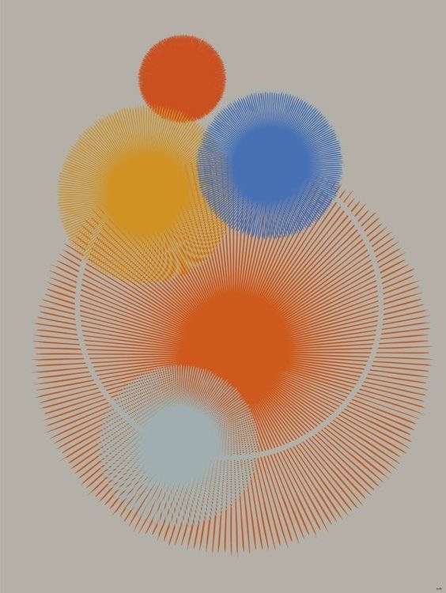

# Radial Fiber Fields — primary visual reference



## Status and role

This image is a primary behavioral reference for a distinct Day Objects visual
family called **Radial Fiber Fields**.

It demonstrates how circle-derived actors can be generated from many fine
radial elements rather than from flat fills or conventional gradients. Its
essential contribution is a procedural construction principle: a soft core,
a variable-density field of connected radial marks, and controlled interaction
between neighboring fields.

Apply the shared seed hierarchy, identity rules, compatibility system, and
mutation budget from [`Day Objects Generative DNA`](../system/01-generative-dna.md).
This document defines the family-specific visual behavior.

It is not a pixel-perfect target. It does not prescribe exact colors,
coordinates, actor count, line count, radii, or one fixed mathematical formula.
Preserve its relationships:

- a small number of actors creates a clear vertical hierarchy;
- actors remain circle-derived while differing strongly in scale and internal
  density;
- a compact core transitions gradually into a porous radial perimeter;
- fine marks create optical softness without a pasted-on blur;
- overlaps produce woven, transparent, materially meaningful intersections;
- one incomplete circular gesture can connect several actors without becoming
  a diagram;
- a quiet background gives the line fields enough room to remain legible;
- randomness changes the construction, not merely the final color.

Use this reference as a generative grammar. Do not treat the five visible
objects as five frozen templates to be copied into every scene.

## First perceptual read

The first read is a vertical family of colored circular presences gathered
around one dominant lower anchor. The eye enters through the large warm field,
moves upward through two overlapping medium actors, and finishes at the small
top accent. A pale lower actor counterbalances the upper group.

The second read reveals that the circles are not conventional filled discs.
Their apparent gradients are produced by thousands of fine radial strokes:
very dense near a core, more separable toward the edge. Where actors overlap,
their marks interlace and create new local densities.

The third read reveals an incomplete pale arc passing through the dominant
field. It behaves simultaneously as a contour, a gap, and a connective gesture.
It adds complexity without introducing an unrelated shape language.

The composition therefore works at three distances:

1. from far away, as a simple hierarchy of circular color masses;
2. at normal viewing distance, as soft fields with depth and overlap;
3. up close, as a precise system of many lines, gaps, and interference zones.

A successful Day Objects adaptation should retain all three readings.

## Core visual idea

The family is based on **a circle reconstructed from radial samples**.

An actor is not primarily a bitmap circle. It is a stable procedural identity
that can be rendered through different related manifestations:

- a dense central field surrounded by radial fibers;
- a soft disc whose edge dissolves into separated but still legible fibers;
- an annulus assembled from repeated marks;
- an incomplete fiber ring;
- a circle with a slightly lobed or star-like radial envelope;
- a sparse circular constellation whose implied perimeter remains legible;
- a hybrid containing a core, fibers, and one partial contour.

These are positions in one continuous parameter space, not unrelated shape
presets. Moving a parameter should transform one state into another gradually.

The topological origin remains circular. Even when an actor becomes lobed,
elliptical, hollow, sparse, or star-like, the viewer should still understand it
as a mutation of a radial field rather than a new icon placed on the canvas.

## What the reference contributes to Day Objects

Earlier Day Objects references establish broad gradient fields, transparent
overlaps, mist, rings, and constellations. This reference adds four specific
capabilities:

1. **Structural softness** — softness can emerge from decreasing sample density
   and line accumulation, not only from Gaussian blur.
2. **Continuous shape mutation** — one radial generator can produce discs,
   halos, annuli, incomplete contours, lobes, and restrained stars.
3. **Meaningful microstructure** — fine marks give every actor tactile identity
   while the macro silhouette stays simple.
4. **Procedural interaction** — overlapping actors create new woven regions
   because their internal structures coexist visibly.

This makes the family useful for generative variety. It expands the design
space without requiring a library of hand-authored finished shapes.

## Composition grammar

### Vertical stack with unequal weight

The reference uses a loose vertical stack rather than a ring, grid, or even
column. Actor centers drift left and right around an implied vertical axis.
Their edges overlap, but their centers do not align mechanically.

The stack contains several distinct weight roles:

- one dominant lower anchor;
- two medium upper actors forming an asymmetric pair;
- one small terminal accent above them;
- one pale counterweight overlapping the lower anchor.

The generator may rotate, bend, or partially break this stack. Preserve the
unequal hierarchy and relational flow rather than the literal orientation.

### Dominant anchor

The largest actor occupies much of the lower half and establishes the scene's
primary scale. It is visually heavy because of diameter, line length, and core
density, not because it is an opaque solid sticker.

The anchor may be partly occluded or crossed by a contour. It should still read
as one stable actor. Its internal field may be richer than the smaller actors,
but it should share their construction logic.

### Upper pair

Two medium actors overlap near the upper third. They are similar enough to form
a pair but differ in scale, density, and position. Their overlap demonstrates
the material behavior at a moderate size where both macro color and individual
fibers remain visible.

Avoid making every pair the same size or placing pairs symmetrically around the
canvas center.

### Terminal accent

The small top actor closes the upward movement and creates scale contrast. It
is compact and relatively simple. It does not need the complete material
complexity of the anchor.

Small actors should not be reduced to decorative confetti. Their position must
complete a larger compositional gesture.

### Pale counterweight

The lower pale actor overlaps the dominant anchor and keeps the composition
from becoming a single warm mass. Its lower contrast lets it act as depth and
breathing room at the same time.

The counterweight role may be expressed by lower opacity, lower chroma, shorter
fibers, or lighter density. It does not require a literal pale color.

### Negative space

The actors occupy the central vertical region while broad background margins
remain visible on every side. This quiet field makes the delicate ray tips and
transparent overlaps readable.

For this family, negative space should usually remain more generous than in the
dense Editorial Gradient Overlap family. Do not scatter tiny marks into every
empty area merely because the generator has available actors.

### Canvas boundaries

The source keeps the principal actors inside the frame. Edge cropping is not
the main depth mechanism here. A Day Objects scene may crop one large actor or
allow fibers to leave the canvas, but repeated aggressive cropping would erase
the characteristic feathered perimeter.

Use edge contact as an occasional compositional choice, not an invariant rule.

## Scale and happening count

The visible image contains five principal actors. Thousands of line segments
belong to those actors and must not be counted as separate happenings.

For Day Objects:

- one happening maps to one stable actor identity;
- fibers, core layers, arcs, and local contour fragments are internal
  material components of that actor;
- an interaction arc may belong to one actor or to scene-level connective
  material, but it is not an additional happening by default;
- adding or removing a happening must not reseed the surviving actors.

At ten happenings, the generator should not produce ten equally detailed
sunbursts. A useful distribution is:

- one or two anchors;
- two or three medium structural actors;
- two or three smaller satellites;
- the remaining actors as restrained counters, echoes, or sparse fields.

Complexity budget should be role-dependent. The largest object may contain the
most fibers, but perceived density should not increase mechanically with area.

## Anatomy of a Radial Fiber actor

### Stable center

Every actor starts with a stable local center. This is the origin for geometry,
not necessarily the brightest, darkest, or densest visible point.

The material center may be shifted slightly away from the geometric center.
The shift should create organic imbalance without producing the sharp inner
spot or eye-like pupil previously rejected in Day Objects reviews.

### Soft core

The core is an area where marks overlap densely enough to read as a continuous
field at normal size. It may be generated from:

- many short radial segments;
- a broad low-contrast radial field;
- a dense accumulation of short connected fibers;
- several transparent layers with related colors;
- a combination of the above.

The core boundary must be gradual. It must not appear as a smaller hard circle
inside a larger circle.

### Fiber zone

The fiber zone extends from the core toward the perimeter. Individual marks
become increasingly visible as density or overlap decreases.

Useful variables include:

- number of fibers;
- angular spacing regularity;
- starting radius;
- ending radius;
- line thickness;
- opacity;
- curvature;
- angular jitter;
- radial jitter;
- taper at either endpoint;
- density falloff curve.

These parameters should be correlated. For example, fewer fibers may require
slightly thicker or softer marks to preserve the actor's macro silhouette.

### Feathered perimeter

The perimeter is formed by the collective endpoints of many marks. It should
feel porous and alive while preserving a clear overall circular boundary.

Endpoint lengths may vary smoothly around the circumference. Independent
high-frequency randomness at every ray creates a hairy or electrically noisy
edge. Prefer low-frequency envelopes plus small local variation.

### Optional contour or arc

An actor may include a complete or incomplete circular contour. The contour can
cross a fiber field, define an internal void, or connect visually to a neighbor.

It must share the scene's line character. A perfectly clean vector ring placed
over textured fibers will look like a separate UI element unless deliberately
integrated through opacity, thickness, and overlap.

### Optional void

Reducing core density can create a hollow or annular state. The void should
emerge from the same radial construction rather than from a hard opaque cutout.

The void may be offset, but avoid a small centered hole that reads as an eye,
button, target, or error.

## Interaction grammar

### Fiber-over-fiber overlap

When two actors overlap, both line fields remain present. Their marks create a
denser woven region whose structure depends on relative angle, density, and
opacity.

The overlap should not simply darken to mud. Maintain enough transparency and
color separation for the new region to feel like an intentional third state.

### Core-over-fiber overlap

A dense core crossing a porous perimeter creates clear depth. The core may sit
in front while the neighbor's fibers remain visible around it, or the fiber
field may pass over the core with reduced opacity.

Draw order should vary by stable scene role, not flicker or reverse during
motion.

### Contour crossing

The pale incomplete arc in the source crosses the dominant actor and passes
near the lower counterweight. It creates a large-scale circular echo that is
different from the actors' local rays.

This gesture is valuable but should be rare. Several similar arcs will turn the
scene into a technical diagram or orbital map.

### Tangency and near-tangency

Actors may touch, narrowly miss, or overlap. A mix of these relationships keeps
the stack from becoming one fused cluster.

Avoid repeated exact tangency. It tends to produce decorative bubble chains.

### Density interference

Line crossings generate optical texture. This is part of the material, but it
must remain stable at target resolution. Uncontrolled high-frequency patterns
can become moiré, false color, or flicker.

The renderer should test line density at full-screen and calendar-tile sizes.
At small sizes, it may need analytic integration, multisampling, or a derived
lower-frequency representation rather than literal one-pixel fibers.

## Color behavior

The reference uses a small set of distinct color roles, but the exact hues are
not the contract.

Preserve these relationships:

- adjacent actors have distinguishable dominant identities;
- the anchor carries sufficient chromatic weight to lead the composition;
- one lower-contrast actor provides atmospheric relief;
- overlaps create clean derived colors instead of gray-brown mud;
- the background stays quiet enough for thin marks to remain visible;
- each actor uses colors from its approved object palette.

A single-color actor must remain genuinely single-color. Apparent tonal change
may arise from density, transparency, and background interaction, but a second
unapproved hue must not appear in its core.

Multicolor variants may use related color along the radial structure. Changes
must remain broad and smooth; no sharp angular wedges, linear bands, or pasted
inner spots.

## Structural texture and grain

The primary texture here is structural: it comes from the repeated fibers and
their spacing. This differs from a global print-grain overlay.

Global grain may still be used to connect the scene to other Day Objects
families, but it should not obscure the radial construction. At phone scale:

- fibers establish directional microtexture;
- subtle grain prevents sterile digital flatness;
- the two textures should not multiply into heavy visual noise;
- grain must remain stable in screen space or actor space during motion;
- compression should not turn the fibers into crawling artifacts.

## Depth and focus

Depth should arise from a combination of scale, density, contrast, occlusion,
and controlled softness.

Large foreground actors may be more defocused, consistent with the Editorial
Field specification. However, blur must not destroy every ray. One useful
translation is to keep the broad fiber envelope visible while merging nearby
lines into a softer field.

Smaller distant actors can be more sharply resolved, but they should not become
crispy icons against a soft scene. Focus is relative, not binary.

Possible depth signals:

- larger radius and longer fibers for near actors;
- lower local sharpness for the nearest field;
- slightly reduced contrast for atmospheric actors;
- stable occlusion ordering;
- slower apparent parallax for distant actors;
- more visible individual fibers in selected middle-depth actors.

## Procedural shape grammar

### Principle: generate construction, not finished presets

The generator should not choose among five authored images named `orangeDisc`,
`blueHalo`, or `paleRing`. It should construct every actor from a compact set of
rules and a stable seed.

The result may resemble a disc, ring, halo, soft star, or lobed field, but these
labels describe outcomes rather than fixed assets. A visible point cloud is not
an approved outcome.

### A radial envelope

At the center of the grammar is a periodic radial envelope `r(theta)`. A simple
conceptual model is:

```text
r(theta) = baseRadius
         * ellipseCorrection(theta)
         * lowFrequencyShape(theta)
         * localEndpointVariation(theta)
```

The exact implementation is open. The important constraints are:

- the function closes continuously around the actor;
- low-frequency variation controls the primary silhouette;
- high-frequency variation remains subtle;
- parameters are deterministic for a given actor identity;
- the silhouette stays recognizably circle-derived.

### Circle-to-lobe continuum

Low-frequency harmonics can move an actor away from a perfect circle:

- near-zero amplitude produces a circle;
- one or two broad components produce an organic, slightly irregular body;
- three to five gentle components produce soft lobes;
- a stronger periodic component can approach a restrained star-like field;
- reducing interpolation can expose a small number of structural directions.

This should be a continuum. Do not introduce a separate literal star icon with
sharp vertices. A star-like actor remains soft, radial, and materially related
to the circles around it.

### Control-sampled radial envelope

A circle may be constructed internally from angular control samples rather than
a perfect analytic perimeter. The generator may vary the number of samples:

- many samples imply a nearly continuous smooth circle;
- a moderate count creates broad rhythmic structure;
- a low count creates a rounded polygonal or star-like tendency;
- omitted angular sectors create partial arcs or broken perimeters.

Control samples are invisible construction data. They must be interpolated into
a continuous contour or connected fiber structure and must never remain as a
visible disconnected dot field. Softness must prevent low counts from becoming
hard geometric badges.

### Fiber count

Fiber count is one of the strongest material variables, but it should not be
uniformly random across the full numerical range.

Use weighted regimes:

- sparse: individual marks and gaps are prominent;
- open: silhouette is clear but porous;
- dense: the actor reads as an optical gradient;
- saturated: the core approaches a continuous field.

The scene should contain only a few regimes at once so its material DNA remains
coherent.

### Inner and outer radius

Each fiber may have an inner and outer endpoint. Their distributions determine
whether the actor reads as a filled field, halo, annulus, or broken contour.

- inner endpoints near the center produce a dense disc;
- inner endpoints away from the center create a ring;
- smoothly varying inner radius creates an offset or breathing void;
- missing angular sectors create an incomplete form;
- correlated outer-radius waves create lobes or a soft star.

### Curvature and phase

Fibers do not need to be perfectly straight. A small angular phase difference
between inner and outer endpoints can produce gentle twist, woven volume, or a
spirographic tendency.

Keep curvature restrained within this family. Strong repeated twisting belongs
more naturally to Linework Constellation and may turn the actor into a rosette.

### Core density falloff

Density should change through a continuous falloff curve. Useful families
include broad ease curves, asymmetric smooth steps, and layered low-frequency
fields.

Avoid a short, steep falloff that creates the eye-like inner circle rejected in
earlier Day Objects iterations. The transition zone should occupy a meaningful
fraction of the actor radius.

### Contour completeness

A contour can vary continuously from absent to complete:

- no contour;
- a short local arc;
- two separated arc fragments;
- one dominant incomplete circle;
- a nearly complete perimeter;
- a complete but low-contrast ring.

Arc length, rotation, thickness, and opacity are seeded independently within
role-dependent bounds.

### Opacity and compositing

Opacity determines whether the fibers behave as drawn lines, translucent
material, or an optical solid. It must be coupled to line count and thickness.

Increasing all three simultaneously can crush overlaps into opaque mud.
Decreasing all three can make the actor disappear. The generator should target
a bounded perceived coverage rather than sampling each parameter independently.

## Levels of randomness

### Scene grammar seed

The scene seed determines high-level relationships:

- compositional gesture;
- number and location of anchors;
- occupied and empty regions;
- scale hierarchy;
- overlap graph;
- palette family;
- dominant depth direction.

It should not encode every individual mark directly.

### Actor identity seed

Each happening receives a persistent identity seed. It determines:

- circle-derived topology;
- base radius and depth role;
- envelope harmonics;
- envelope complexity and fiber regime;
- core, void, contour, and arc characteristics;
- approved object palette selection;
- stable draw-order tendencies.

Surviving identities remain unchanged when other happenings appear or disappear.

### Material seed

A material seed controls fine but stable variation:

- per-fiber length and opacity variation;
- subtle endpoint jitter;
- line-width distribution;
- grain phase;
- broad internal color-field offsets;
- local density modulation.

Material randomness must be deterministic and temporally stable. It must not be
resampled every frame.

### Motion seed

Motion receives a separate seed so visual identity does not change when motion
settings change. It controls:

- drift direction;
- phase;
- amplitude;
- period;
- parallax coefficient;
- optional slow breathing of the radial envelope.

### Correlated randomness

The strongest results will come from correlated variables rather than uniform
independent sampling.

Examples:

- near actors are larger, softer, and move with stronger parallax;
- sparse fiber actors use clearer contours to preserve silhouette;
- low-control-sample actors use gentler deformation and rounder interpolation;
- highly transparent actors avoid the lowest-contrast palette role;
- star-like envelopes use fewer internal color changes;
- scenes with dense overlaps allocate more negative space elsewhere.

Correlation creates believable families while preserving visible variety.

### Bounded surprise

The generator should reserve a small probability for a visibly unusual actor:

- an exceptionally sparse but connected fiber field;
- a broad incomplete arc;
- a softly lobed or star-like field;
- an almost hollow annulus;
- an unusually long feathered perimeter.

Only one or two surprises should appear in a ten-happening scene. If every actor
is exceptional, there is no hierarchy and the scene becomes a demo catalog.

## Candidate continuous shape space

The following outcomes can be generated from the same radial grammar. They are
not mandatory named presets:

### Optical disc

Dense short fibers converge into a broad continuous core and dissolve gently at
the edge.

### Fiber halo

A smaller core is surrounded by long, individually visible radial marks.

### Porous annulus

Inner endpoints remain away from the center, creating a breathable opening.

### Broken orbit

Angular sectors are omitted or attenuated, leaving one or more implied arcs.

### Rounded polygon field

A low number of support directions gently influences the perimeter while
interpolation preserves a soft circle-derived silhouette.

### Soft star field

A periodic radial envelope creates restrained lobes. Vertices remain feathered,
and the object does not become a literal symbol.

### Offset-core body

The visual density center moves away from the geometric center while the outer
envelope remains coherent.

### Arc-and-field hybrid

One partial contour crosses or surrounds a fiber body, providing structural
contrast without changing its material family.

### Dissolving field

Fiber density decreases asymmetrically until part of the actor nearly merges
with the background. The remaining silhouette must still be recoverable.

## Composition generation

### Generate roles before coordinates

First assign actors compositional roles, then sample their positions. Role
assignment should determine plausible scale, density, contrast, and overlap
tendencies.

Possible roles include:

- anchor;
- partner;
- bridge;
- counterweight;
- satellite;
- terminal accent;
- ghost field.

This prevents ten happenings from becoming ten unrelated random circles.

### Generate an interaction graph

Before exact placement, generate a sparse graph describing intended relations:

- overlap;
- near-tangency;
- containment;
- contour crossing;
- visual echo;
- deliberate separation.

Positions can then be solved or relaxed to satisfy these relations while
retaining negative space.

### Use families of gestures

The source suggests a vertical stack, but the production generator can derive
related gestures:

- upright stack;
- leaning stack;
- shallow arc;
- descending chain;
- split pair around one anchor;
- one compact knot with a detached terminal accent.

Gesture choice should vary between days. Within one day it should remain the
organizing principle for all actors.

### Preserve irregularity

Random placement alone often produces either a central pile or evenly scattered
confetti. Use constraints for:

- minimum and maximum local density;
- at least one meaningful overlap;
- protected negative-space regions;
- unequal nearest-neighbor distances;
- avoidance of common centers and equal rows;
- balance of visual mass rather than coordinate symmetry.

## Palette generation without fixed colors

This reference should not lock Day Objects to its literal palette. Instead,
generate role relationships from approved palette families:

- one dominant identity;
- one contrasting or distant partner;
- one neighboring related identity;
- one low-contrast atmospheric identity;
- optional small accent.

Colors should be selected with background awareness. The chosen color for a
single-color actor remains unified across its entire body and stable over time.

For multicolor actors, broad related radial fields may alter color across the
fiber structure. The blend should remain smooth, and the resulting overlap
colors should be checked for mud.

## Motion translation

Motion is added only after the static composition and material pass.

The safest motion for this family is slow whole-actor drift with depth-based
parallax. Each actor keeps its geometry, identity, line pattern, and color.

Permitted subtle secondary motion may include:

- very slow expansion and contraction of the full radial envelope;
- small coherent changes in fiber length;
- slow phase drift shared across neighboring fibers;
- gentle contour breathing;
- gradual translation of an offset density center.

Avoid:

- rapid local rotation;
- continuously spinning radial spokes;
- per-frame random jitter;
- independent motion of thousands of fibers;
- line-density changes that create crawling moiré;
- pulsing that resembles an audio visualizer;
- topology changes that turn circles into stars and back during normal motion.

Shape identity is selected at scene creation. Motion animates the actor; it does
not continuously reroll its design.

## Reduce Motion

With Reduce Motion enabled:

- remove or strongly reduce parallax;
- freeze rotational and phase changes;
- keep only an optional near-imperceptible whole-field drift or static state;
- preserve all material density, color, overlap, and compositional hierarchy;
- do not replace detailed actors with different simplified identities;
- do not resample fibers or grain.

The Reduce Motion frame should look like the same artwork at rest.

## Rendering considerations

### Antialiasing and resolution

Fine radial lines are vulnerable to aliasing. Render quality must be assessed at
actual device scale, not only in enlarged screenshots.

Potential strategies include:

- analytic line coverage;
- multisampling;
- resolution-aware minimum line width;
- density preintegration for distant or small actors;
- stable actor-space sampling;
- a lower-frequency calendar-tile representation derived from the same recipe.

Do not solve aliasing by applying heavy global blur. That would erase the
reference's structural texture.

### Calendar tile

At calendar-tile size, thousands of literal fibers may collapse into noise. The
renderer may reduce fiber count or integrate density, provided it preserves:

- actor silhouette;
- hierarchy;
- dominant color identity;
- major overlap regions;
- the distinction between dense core and porous edge.

The tile is a scale-aware rendering of the same `SceneRecipe`, not a separately
composed image.

### Performance budget

Fiber count should be treated as a visual parameter decoupled from raw GPU
primitive count. Instancing, analytic shaders, or procedural evaluation may
represent many apparent fibers efficiently.

Do not let a richer material silently change happening count or stable object
identity.

## Negative signatures

Reject a generated scene if it shows any of the following:

- five or ten identical sunbursts with only color changed;
- literal flowers, daisies, gears, or mechanical rosettes;
- sharp star icons unrelated to the circular material family;
- hard inner discs that read as pupils or errors;
- narrow steep gradients producing eye-like highlights;
- evenly spaced spokes with no density modulation;
- random high-frequency hair around every perimeter;
- line aliasing, false color, crawling moiré, or flicker;
- muddy overlaps that lose both parent colors;
- equal-sized actors arranged in a neat column;
- a centered pile with unused outer canvas regions;
- excessive arcs turning the scene into an orbital diagram;
- global blur that erases the fiber construction;
- per-frame resampling of lines, contours, grain, or color;
- a complete catalog of discs, rings, halos, and stars in one day;
- visible point clouds or disconnected particle fields;
- shape variation that breaks the circle-derived visual universe.

## Acceptance checklist

### At first glance

- [ ] The scene reads as one editorial composition rather than a collection of
      radial icons.
- [ ] There is a clear scale and weight hierarchy.
- [ ] Negative space is intentional and visually active.
- [ ] No common ring, grid, row, or mechanical center dominates the scene.

### Actor construction

- [ ] Each actor can be explained by the shared radial grammar.
- [ ] Dense cores transition gradually into porous edges.
- [ ] Circle-derived mutations remain related without becoming identical.
- [ ] Any lobed or star-like actor remains soft and non-symbolic.
- [ ] Single-color actors contain no accidental secondary hue.

### Interaction

- [ ] Overlaps create legible woven or transparent third states.
- [ ] At least two different interaction types are visible.
- [ ] Draw order is stable and understandable.
- [ ] Contours and arcs feel structurally integrated.

### Procedural variety

- [ ] Variation comes from parameters, not a lookup table of finished images.
- [ ] The seed reproduces the same scene exactly.
- [ ] Actor identities survive insertion and removal of other happenings.
- [ ] Random variables are role-aware and correlated.
- [ ] The scene contains bounded surprise without becoming a feature catalog.

### Depth and scale

- [ ] Near large actors are softer than smaller focused actors where applicable.
- [ ] Fibers remain visible enough to communicate the material.
- [ ] Small actors remain purposeful at full-screen and tile sizes.
- [ ] The scene does not flatten into one focus plane.

### Motion

- [ ] Motion is slow, continuous, and depth-dependent.
- [ ] No actor spins rapidly or rerolls its topology.
- [ ] Fine lines do not crawl or flicker.
- [ ] Reduce Motion preserves the same static artwork.

## Relationship to the other reference families

### Editorial Gradient Overlap

Editorial Gradient Overlap builds actors primarily from broad smooth color
fields and transparent lenses. Radial Fiber Fields builds optical gradients
from repeated marks and density.

They may share palette logic, scale hierarchy, and transparent compositing, but
a single day should choose which material mechanism is primary.

### Linework Constellation

Linework Constellation uses many different circular topologies distributed
along a directional chain. Radial Fiber Fields uses a smaller shared actor
anatomy and explores continuous variation inside it.

The families may share rings and fine lines. Do not merge their complete shape
catalogs into one scene. A Radial Fiber day should feel like several mutations
of one field; a Linework Constellation day may feel like a related ecosystem of
different circular structures.

### Mist, depth, and grain

Mist may soften near actors and integrate the background, but it should support
rather than replace the radial microstructure.

### Editorial Field composition

The broader Editorial Field rules still apply: asymmetric placement, meaningful
negative space, strong scale variation where selected, depth, overlap, edge
awareness, and no regular rings or grids.

This reference adds a new material and topology grammar; it does not authorize
returning to identical clusters or mechanical layouts.

## Suggested future generator experiment

Before production integration, build a lightweight seeded shape-space sheet
using one fixed composition and palette relationship. Vary only these axes:

1. radial-envelope complexity;
2. fiber-density regime;
3. inner-radius regime;
4. low-frequency envelope amplitude;
5. contour completeness;
6. core falloff width.

The sheet should show whether the parameter space produces genuinely different
but related actors. It should not be presented as a final composition catalog.

After the actor grammar is coherent, evaluate it in several independently
seeded compositions. This order separates shape-system quality from placement
quality and makes failures easier to diagnose.

## Compact implementation contract

For a future `SceneRecipe` representation, each actor needs enough stable data
to reconstruct its identity without storing a finished bitmap:

```text
actorID
role
position
depth
baseRadius
radialEnvelopeSeed
envelopeComplexity
fiberDensityRegime
innerRadiusProfile
outerRadiusProfile
coreFalloff
contourProfile
opacityProfile
paletteRole
materialSeed
motionSeed
```

Exact field names are not prescribed. The important distinction is between:

- stable semantic identity;
- deterministic geometric and material generation;
- composition-level constraints;
- time-dependent motion that never rerolls identity.

## Final rule

The reference should expand Day Objects through **procedural relatedness**.

Do not copy the visible five circles. Build a generator capable of producing
many circles and circle-derived forms that feel as though they were made by the
same physical process: marks gather into a core, extend into a field, interact
with neighboring fields, and dissolve back into space.

The strongest outcome is not maximum formal variety. It is the largest
meaningful variety that still reads as one authored visual language.
