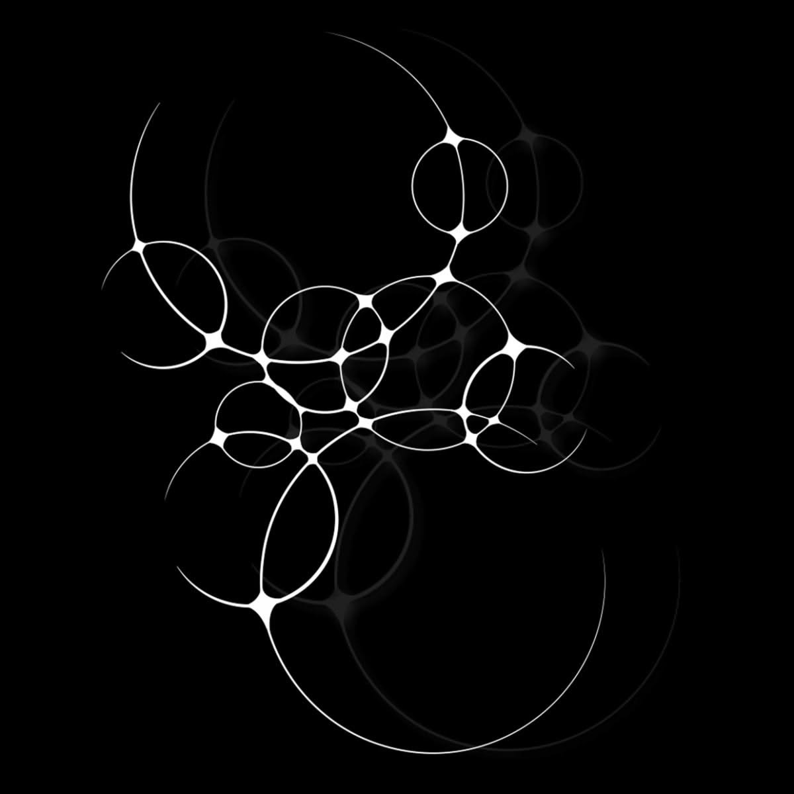

# Tensioned Loop Network — primary visual reference



## Status and role

This image is a primary behavioral reference for a distinct Day Objects visual
family called **Tensioned Loop Network**.

It contributes a new interaction principle: circle-derived loops do not merely
overlap or sit beside one another. Selected contours deform toward their
neighbors, fuse through narrow bridges, and become one continuous tensioned
network.

Apply the shared seed hierarchy, actor identity, compatibility, mutation
budget, and `SceneRecipe` boundary from
[`Day Objects Generative DNA`](../system/01-generative-dna.md). This document
defines the family-specific geometry, interaction, edge, depth, and motion
behavior.

The reference is not a pixel-perfect target. It does not require a black
background, white lines, exact loop count, exact coordinates, or the literal
bright junction shapes. Preserve its relationships:

- loops remain round or softly oval while participating in a shared network;
- selected neighbors connect through narrow, smoothly widening necks;
- line width grows around tension junctions and returns gradually to hairline;
- large, medium, and small loops create a clear structural hierarchy;
- the foreground network is accompanied by quieter offset echoes;
- the network occupies an irregular diagonal and vertical path;
- broad empty regions prevent the structure from becoming uniform foam;
- complexity comes from topology and connection, not decorative particles.

## First perceptual read

The image reads first as a luminous organism suspended in a dark field. A chain
of bright circular membranes gathers around the center, then opens into much
larger loops toward the top and bottom.

The eye does not initially read a pile of separate rings. It reads one connected
gesture. Thin arcs lead into brighter pinched junctions, junctions divide into
new arcs, and the network repeatedly expands and contracts.

On a second read, individual circle-derived loops become visible. Some are
nearly complete. Some are interrupted by shared bridges. Some appear nested or
threaded. Their varying diameters create an organic hierarchy rather than a
repeated cell pattern.

On a third read, a dim duplicate or echo becomes visible behind the bright
network, slightly offset toward one side. This low-contrast layer increases
depth and suggests another phase of the same structure without introducing a
different material language.

## Core visual idea

The family is based on **circular contours under relational tension**.

Each primary actor begins as a circle-derived loop. Its final geometry depends
partly on neighboring actors:

- an isolated region remains a clean arc;
- a nearby compatible neighbor attracts the contour;
- the approaching contours narrow into a bridge;
- line width increases around the bridge;
- the bridge may split into several continuous arcs;
- the complete result remains smooth and membrane-like.

This is not conventional overlap. In a normal overlap, two complete rings can
still be traced independently through the intersection. In this family,
selected contours share a local junction and visually become one connected
topology.

## What the reference adds to Generative DNA

This family introduces several reusable genes:

### Connected-loop geometry

Circle-derived actors may own relational deformation zones near selected
neighbors. Their global silhouettes remain legible while local sections stretch
into shared junctions.

### Tension bridge interaction

Two loops can be connected through a narrow continuous neck rather than merely
touching or overlapping.

### Shared-junction interaction

Several loop boundaries may meet at one smooth saddle-like region. The junction
belongs to the relationship graph and is not an independent decorative actor.

### Variable-width tension edge

A contour can move continuously from hairline to a broader junction and back.
Thickness communicates local tension and topology.

### Depth echo

The complete network or selected branches may have a dim, offset, and slightly
softer related echo. The echo derives from the same phenotype and does not count
as another happening.

## Composition grammar

### Connected current

The composition follows an invisible current that bends from one upper region
through a dense middle and toward a large lower loop. It is neither a straight
column nor a complete circle.

The current is inferred through:

- successive loop centers;
- repeated junctions;
- changes in scale;
- partial arcs continuing beyond local clusters;
- the displacement of the ghost network;
- alternating compression and release.

The generator may rotate, mirror, bend, or reverse this current. Preserve the
single connected gesture rather than the source orientation.

### Structural anchors

The largest loops anchor the network. In the source, one dominates the lower
field and another opens the upper area. These anchors are large enough to create
negative space inside themselves as well as around the complete network.

An anchor should not be a uniformly heavy ring. Its visible weight comes from
scale, curvature, connected junctions, and selected bright sections.

### Dense connective middle

Most medium and small loops gather around the center. Their purpose is to join
the large anchors through a changing sequence of bridges and openings.

The middle is dense but not homogeneous. It contains:

- a few compact loops;
- elongated horizontal or diagonal openings;
- junctions of unequal brightness and width;
- arcs that pass through rather than terminate;
- small pockets of untouched background.

Avoid filling the central region with equal soap-bubble cells.

### Terminal arcs

Several arcs extend away from the dense network and fade or leave the visible
structure without closing immediately. They enlarge the implied system and give
the composition direction.

Terminal arcs must remain sparse. Too many loose ends turn the family into a
scribble or wire diagram.

### Negative space

Large quiet regions surround the network, especially near corners and between
major branches. The interiors of the large loops also act as negative space.

Negative space serves three functions:

- it reveals the finest contours;
- it distinguishes the network from foam or mesh;
- it gives scale to the largest loops.

Do not add disconnected marks to empty regions. If balance is weak, adjust the
network geometry or its anchors rather than decorating the background.

### Canvas boundaries

The source network remains mostly contained, though several arcs approach the
frame. A generated scene may crop a large loop or allow one branch to continue
beyond an edge, but cropping should not destroy the main junction hierarchy.

The family should feel suspended in a larger space, not accidentally clipped.

## Scale hierarchy

Scale varies continuously across the network:

- very large loops establish the macro gesture;
- large loops create major voids;
- medium loops carry the main connective rhythm;
- small loops tighten selected junctions;
- tiny independent circles are not required.

The system must avoid a repeated cell size. A field of similar medium loops
will resemble foam, chainmail, or a biological diagram.

For a ten-happening scene, a useful initial hierarchy is:

- one or two major anchors;
- two or three large or medium structural partners;
- three or four connective actors;
- one or two small terminal actors.

This is a weighted role model rather than a fixed template.

## Happening identity

One happening maps to one primary loop actor. A loop may own:

- a complete or partial contour;
- local deformation toward selected neighbors;
- its contribution to one or more shared bridges;
- family-compatible depth echo geometry;
- stable edge and motion parameters.

Shared bridges are interaction geometry. They do not create extra happenings.

When an actor is removed:

- only bridges incident to that actor disappear;
- surviving loop identities remain unchanged;
- surviving base contours retain their stable parameters;
- a bounded local relaxation may close or soften the exposed contour;
- the complete network must not reroll.

When an actor appears:

- it may establish a limited number of new compatible edges;
- existing actors deform only in the local influence region;
- unrelated branches remain visually stable;
- the addition must not trigger a scene-wide re-layout.

## Loop anatomy

### Base loop

Every actor starts from a stable closed radial or softly oval contour. The base
loop may vary in:

- radius;
- aspect ratio;
- low-frequency deformation;
- rotation;
- completeness;
- nominal line width;
- depth and focus.

The base loop remains recoverable even after relational deformation.

### Influence sectors

Only selected angular sectors respond to neighbors. An influence sector is
centered around the direction from one actor to a connected actor.

Its width controls whether the response feels like:

- a precise narrow neck;
- a broad membrane bridge;
- a shared flattened boundary;
- a gentle attraction with no complete fusion.

Influence sectors should blend continuously into the unaffected contour.

### Neck

The neck is the narrowest part of a two-actor bridge. It should feel stretched,
not pinched by a hard Boolean operation.

Useful variables include:

- neck width;
- bridge length;
- curvature;
- line-width gain;
- asymmetry;
- brightness or opacity gain;
- local softness;
- connection angle.

Neck parameters must be constrained by actor distance and scale. A long thick
bridge between distant small loops will look like an arbitrary connector.

### Shared junction

A shared junction may connect two, three, or occasionally four local contour
branches. Its shape resembles a smooth saddle or stretched membrane node.

The source contains bright pointed junctions, but the implementation must not
copy them as repeated star symbols. Their apparent points should emerge from
the curvature and width transition of connected contours.

### Opening

The enclosed negative shape between bridges is as important as the line. It may
be circular, oval, triangular with rounded corners, or elongated.

Openings should vary strongly in scale and aspect. Repeated equal openings make
the network look cellular and mechanical.

### Terminal branch

A loop may be incomplete where the network extends beyond its local cluster.
The terminal branch should taper or fade intentionally. A blunt line ending
looks like a rendering error.

## Interaction grammar

### Attraction without contact

Two nearby contours bow toward each other but retain a narrow gap. This creates
tension while preserving separation.

Use it to vary rhythm between fully connected regions.

### Tangency

Contours meet at one location without forming a substantial bridge. Tangency is
a transitional relation and should not dominate the graph.

Repeated exact tangencies will read as a chain of bubbles.

### Tension bridge

Two contours merge into one narrow neck and then separate. This is the primary
signature of the family.

Bridge shape must derive from both parent loops. It should not look like a third
line drawn between them.

### Multi-branch junction

Three or more contour branches meet through a shared saddle. This creates focal
density and can anchor a cluster.

Multi-branch junctions are rare because they carry high topological complexity.

### Shared boundary

Two neighboring loops may temporarily use one contour segment as a common edge.
The segment then divides smoothly back into separate boundaries.

This relation is especially effective in dense middle regions.

### Containment

A small loop may sit inside a larger loop. It can remain separate, connect to
the larger boundary, or share a short bridge.

Containment must not produce repeated concentric targets.

### Threading

One contour may appear to pass in front of and behind another branch. Use stable
draw order and controlled interruption to communicate depth.

Threading should remain secondary to actual tension connections.

### Echo

A quiet offset contour repeats the main network at another depth. Echo is a
rendered depth relationship, not a new independent topology.

## Topology grammar

### Interaction graph first

Generate a sparse graph before constructing bridges. Each actor is a graph
vertex. An edge declares one intended relationship:

- attraction;
- tangency;
- tension bridge;
- shared boundary;
- containment;
- threading;
- deliberate separation.

The graph constrains geometry. Geometry should not discover every relationship
accidentally from random overlap.

### Graph density

The network needs enough edges to read as connected but not so many that every
actor touches every neighbor.

Useful qualitative regimes:

- sparse chain: one primary path with occasional branches;
- branching current: a path with several local forks;
- twin clusters: two connected dense regions;
- suspended web: one irregular network with large internal openings.

Complete graphs, regular lattices, and repeated degree patterns are forbidden.

### Local degree

Most actors should have one to three meaningful relations. Higher degree is
reserved for one focal junction or anchor region.

The visible number of contour branches may exceed graph degree because one loop
contributes two directions around its perimeter.

### Cycles

The interaction graph may contain cycles, but they should differ in size and
shape. Repeated small cycles create foam. One large structural cycle with a few
smaller loops is usually stronger.

### Connectivity

A scene may contain one detached loop or a separate quiet branch when it helps
negative space. Most visual weight should remain connected through one primary
network.

## Procedural construction

This contract specifies visual behavior rather than one mandatory algorithm.
Two implementation families can satisfy it.

### Implicit contour construction

Smooth scalar fields derived from the base loops and their selected relations
can be combined, then rendered as one or more iso-contours.

This approach naturally creates necks and shared junctions. It must be
constrained carefully so it does not produce generic metaballs or filled blobs.
The target is a tensioned contour network with stable loop identity.

### Parametric curve construction

Base loop arcs can be split at influence sectors and joined with curvature-
continuous bridge segments.

This approach provides precise line-width and topology control. Joins must
maintain tangent and curvature continuity to avoid visible kinks.

### Hybrid construction

An implicit field may determine the junction envelope while explicit curves
control the final contour and line width. This can preserve both organic fusion
and predictable rasterization.

### Algorithm-independent requirements

- base actor identity remains recoverable;
- the same seed reproduces identical topology;
- junction placement follows the interaction graph;
- curves are continuous through bridges;
- line width changes gradually;
- removal modifies only the local network;
- no disconnected visible particles are produced;
- rendering remains stable during slow motion.

## Edge and material behavior

### Primary construction

The primary material is a **Tensioned Contour Network**: a mostly hollow system
whose visible body is its variable-width boundary.

The family is not a collection of solid filled circles. Negative interiors are
part of its identity.

### Hairline arcs

Long isolated arcs may be very thin. They create elegance and scale but must
remain reliably visible on the target background and at calendar-tile size.

### Junction widening

Contour width increases around selected necks and shared junctions. The change
must be gradual and structurally motivated.

Avoid placing identical bright diamonds or four-point stars at every contact.

### Taper and fade

Terminal arcs and depth echoes may reduce opacity or width. A branch should not
fade solely because it is inconvenient to resolve geometrically.

### Softness

The foreground contour may be clean but lightly softened. The echo layer may be
softer. Excessive glow makes the network look neon or hides poor junctions.

### Grain

Grain is optional and subordinate. Heavy grain can break hairlines into visible
dots, which is prohibited. If used, grain must remain stable and preserve
continuous contours.

## Palette behavior

The black-and-white source demonstrates contrast hierarchy, not a mandatory
palette.

Preserve:

- one high-visibility foreground contour role;
- one lower-contrast echo role;
- a background quiet enough for hairlines;
- stable actor and branch color through motion;
- sufficient distinction between foreground and echo.

The network may use one approved color, related tones, or a very restrained
family-compatible variation. It should not assign a different color to every
loop, because shared junctions must read as one material process.

If a multicolor treatment is approved later, color must vary broadly and
smoothly along the network. Sharp color changes at junctions will make them look
like separate icons.

## Depth echo

### Role

The echo suggests another depth plane or a related displaced membrane. It
enriches the scene without adding new shape categories.

### Derivation

The echo is derived from the frozen primary network:

- small stable translation;
- optional slight scale or phase offset;
- lower opacity;
- lower contrast;
- equal or greater softness;
- stable draw order behind the primary network.

It must not independently regenerate topology.

### Scope

The echo may repeat:

- the complete network;
- one connected branch;
- selected anchors and their incident bridges.

Partial echoes can be more atmospheric, but their selection remains stable.

### Negative behavior

Reject the echo if it resembles:

- a motion blur streak;
- a dropped shadow;
- several animation frames accidentally composited;
- a second unrelated network;
- glowing neon bloom.

## Depth and focus

Depth is created through:

- large scale differences;
- overlap and threading;
- variable line weight;
- foreground-versus-echo contrast;
- selective focus;
- stable draw order.

Large near loops may be slightly softer than small distant loops, but this
family depends on contour continuity. Blur must not erase the junction shape.

The depth echo should recede primarily through opacity and contrast, with
softness as a supporting cue.

## Family-specific DNA profile

### Primary geometry region

- circle-derived closed and partial loops;
- broad oval deformation;
- relational contour deformation;
- connected bridges;
- occasional containment;
- variable openings.

### Primary material construction

- Tensioned Contour Network.

### Compatible modifiers

- variable line width;
- subtle softness;
- restrained grain;
- low-opacity depth echo;
- one-color or tightly related palette roles.

### Common interaction region

- attraction;
- tension bridges;
- one-to-three relations per actor;
- unequal openings;
- sparse terminal arcs.

### Supporting mutation region

- one contained loop;
- one shared boundary;
- one threaded crossing;
- one detached terminal actor;
- one partial branch echo.

### Rare mutation region

- one multi-branch focal junction;
- one extremely large loop;
- one long near-hairline arc;
- one asymmetric broad membrane bridge;
- one locally doubled contour.

### Forbidden region

- visible point clouds;
- regular foam;
- chainmail;
- a molecular diagram;
- identical ring chains;
- repeated star junction symbols;
- arbitrary straight connectors;
- sharp Boolean cusps;
- filled metaball blobs;
- fast topology changes;
- per-frame regenerated networks.

## Correlated randomness

The strongest variables are not independent.

Examples:

- a larger loop receives fewer but broader connection sectors;
- a small loop may support a narrower bridge but needs greater line contrast;
- a high-degree junction reduces local contour and color complexity;
- long hairline arcs avoid the lowest-contrast background region;
- a strong depth echo uses fewer additional line effects;
- a dense middle requires larger protected negative space;
- a heavily deformed loop keeps a simpler edge profile;
- a thin elegant network uses restrained motion amplitude.

These correlations preserve authored coherence across seeds.

## Bounded surprise

In a ten-happening scene, one or two unusual topological events are sufficient.
A rare event may be:

- an anchor-sized loop enclosing much of the network;
- a three-way junction;
- a long branch spanning a protected void;
- a partial loop connected at only one end;
- a small loop nested inside an anchor.

Do not combine all rare events in one scene.

## Motion translation

### Whole-network drift

The network may drift slowly as one broad composition. Individual actors retain
small depth-dependent offsets to create parallax without tearing connections.

### Local tension breathing

Bridge width, loop aspect, or influence-sector curvature may breathe very
slowly. Connected actors must move coherently around their shared junction.

### Topology stability

Normal motion does not create or destroy interaction edges. A bridge remains a
bridge, and a detached actor remains detached, until the underlying happening
set changes.

### Echo parallax

The depth echo may move at a slightly different amplitude or phase. The offset
must remain small enough to read as related depth rather than duplicated
animation.

### Forbidden motion

- rapid pulsing;
- boiling metaball boundaries;
- elastic snapping;
- continuously reconnecting graph edges;
- independent jitter at junctions;
- fast local rotation;
- traveling highlights racing along contours;
- echo lag resembling frame persistence.

## Reduce Motion

With Reduce Motion enabled:

- freeze local tension breathing;
- remove or strongly reduce parallax;
- freeze echo phase displacement;
- preserve the exact network topology;
- preserve junctions, line widths, color, and depth hierarchy;
- retain either a static echo or omit it only if the normal echo is purely a
  temporal effect declared outside the phenotype.

The preferred behavior is a static primary network with its stable depth echo.

## Appearance and removal

### Appearance

A new actor may fade and gently expand from its resolved base contour while its
incident bridges widen from zero. The transition should feel like a membrane
establishing tension, not a ring popping into existence.

### Removal

The actor and its incident bridges soften and contract locally. Neighboring
contours return gradually toward their already resolved base loops.

### Identity protection

Insertion and deletion must not:

- change unrelated radii;
- recolor surviving branches;
- reroll the interaction graph outside the local neighborhood;
- move all anchors;
- change the depth echo seed;
- reconstruct the complete scene.

## One-happening behavior

The family must remain valid with one happening even though connection is its
strongest signature.

A one-happening phenotype may use:

- one large incomplete loop;
- a softly asymmetric closed loop;
- one self-related internal opening;
- one restrained depth echo;
- variable line width derived from curvature rather than a junction.

It must not invent additional independent loops and report them as one event.

## Three- and five-happening behavior

With three happenings, use a simple asymmetric chain, one anchor with two
partners, or one contained relation. Preserve at least one large opening.

With five happenings, introduce a branch or one shared boundary while retaining
a clear primary path.

Do not shrink every actor merely to fit the count.

## Ten-happening behavior

With ten happenings, the network may form a dense middle and two or three large
open loops. It should still expose individual scale roles and protected voids.

Ten actors must not become ten equal cells. The viewer should read one current,
not a tiled membrane.

## Full-screen and calendar tile

### Full-screen

Full-screen rendering should preserve:

- gradual line-width transitions;
- smooth junction curvature;
- foreground and echo separation;
- hairline terminal arcs;
- subtle depth and softness.

### Calendar tile

At tile size, line width may be clamped to a visible minimum and the echo may be
attenuated. The renderer must preserve:

- the same network topology;
- major openings;
- large scale hierarchy;
- principal junctions;
- foreground-versus-background contrast.

The tile cannot replace the network with disconnected dots or generic circles.

## Rendering considerations

### Curve continuity

Bridges and junctions require tangent continuity and preferably curvature
continuity. Visible kinks reveal the construction and make the network feel
diagrammatic.

### Variable-width antialiasing

Hairlines and widened junctions must rasterize consistently. The width profile
should be evaluated analytically or with enough sampling to avoid steps.

### High-contrast stability

Bright thin lines on dark backgrounds reveal aliasing and shimmer immediately.
Test at actual phone scale and during motion.

### Echo compositing

The echo should composite in a color-space-correct manner. Low opacity must not
produce dirty halos or unstable banding.

### Performance

Apparent topological complexity must not require a unique draw call for every
arc. A resolved network can be represented as stable curve segments, an
analytic field, or a family-specific shader payload inside one actor/scene
recipe.

## Negative signatures

Reject a generated scene if it shows:

- equal circular cells covering the canvas;
- soap foam or biological tissue;
- chainmail or a regular ring lattice;
- a molecule or node-link diagram;
- literal four-point stars stamped at every junction;
- disconnected circles joined by straight lines;
- arbitrary line crossings with no shared tension;
- hard Boolean union cusps;
- filled metaballs instead of hollow tensioned loops;
- one uniform contour width everywhere;
- excessive neon glow;
- a duplicate layer that looks like a shadow;
- rapid pulsing, boiling, or reconnection;
- unstable hairlines or crawling aliasing;
- disconnected visible particles;
- loss of actor identity after count changes;
- a centered symmetrical cluster;
- no meaningful negative space.

## Acceptance checklist

### First read

- [ ] The scene reads as one connected gesture.
- [ ] Large, medium, and small loop roles are immediately distinguishable.
- [ ] The network has a dense region and meaningful open regions.
- [ ] The result does not read as foam, chainmail, or a diagram.

### Geometry

- [ ] Base loops remain recognizably circle-derived.
- [ ] Relational deformation is limited to selected influence sectors.
- [ ] Bridges are smooth and derive from both connected actors.
- [ ] Junctions emerge from curvature instead of repeated symbols.
- [ ] Openings vary in scale and aspect.

### Interaction

- [ ] The interaction graph is sparse and intentional.
- [ ] Tension bridge is the dominant signature.
- [ ] At least one quieter relation balances complete fusion.
- [ ] Draw order and threading remain stable.
- [ ] Shared geometry is not counted as an extra happening.

### Edge and material

- [ ] Line width changes gradually and structurally.
- [ ] Hairlines remain visible at target scale.
- [ ] Junction widening does not become a star icon.
- [ ] Grain and softness preserve continuous contours.
- [ ] The material remains primarily hollow and boundary-led.

### Depth

- [ ] The foreground network has a clear contrast hierarchy.
- [ ] Any echo derives from the same frozen topology.
- [ ] Echo offset creates depth rather than a shadow or frame trail.
- [ ] Large loops may be softer without losing junction structure.

### Procedural behavior

- [ ] The same seed reproduces the same graph and geometry.
- [ ] Actors are generated from parameters, not finished loop assets.
- [ ] Correlated randomness keeps the family coherent.
- [ ] Rare junctions stay within the mutation budget.
- [ ] No visible point-cloud phenotype appears.

### Motion

- [ ] Whole-network drift is slow and continuous.
- [ ] Connected actors move coherently around shared junctions.
- [ ] Normal motion never changes topology.
- [ ] Hairlines do not shimmer or crawl.
- [ ] Reduce Motion shows the same network at rest.

### Count changes

- [ ] Adding an actor changes only its local neighborhood.
- [ ] Removing an actor removes only incident bridges.
- [ ] Surviving base loops, colors, and seeds remain stable.
- [ ] One-happening output remains valid without fake actors.

## Relationship to other families

### Linework Constellation

Both families use hollow circles, fine contours, and directional composition.

Linework Constellation preserves more independent rings and uses overlap,
nesting, threading, and visual echo. Tensioned Loop Network deforms selected
boundaries into shared bridges and junctions. This topological fusion is its
distinguishing feature.

Do not combine the full spirographic and woven-annulus catalog with the full
tensioned network in one scene.

### Radial Fiber Fields

Radial Fiber Fields builds optical bodies from many internal rays. Tensioned
Loop Network is boundary-led and mostly hollow.

A fiber-built contour could be explored as a future compatible hybrid, but it
is not part of the initial family profile because it would increase both edge
and topology complexity.

### Editorial Gradient Overlap

Editorial Gradient Overlap creates meaning through broad filled color lenses.
Tensioned Loop Network creates meaning through negative interiors and shared
boundaries.

A smooth broad background gradient is compatible. Filling every network cell
with a separate gradient is not.

## Suggested future generator experiment

Use one fixed background and one restrained contour palette. Generate a small
seeded sheet that varies only:

1. loop scale hierarchy;
2. graph density;
3. influence-sector width;
4. bridge width;
5. line-width gain at junctions;
6. depth-echo offset and opacity.

The experiment should verify that different networks remain related without
becoming foam or diagrams. It should not add gradient fills, complex grain, or
motion until topology and edge behavior are approved.

## Compact family profile

```text
family: tensionedLoopNetwork
primaryGeometry: connectedCircleDerivedLoops
primaryMaterial: tensionedContourNetwork
composition: connectedCurrent
interactionGraph: sparseRoleAware
dominantInteractions: attraction, tensionBridge, sharedBoundary
edge: variableWidthTensionContour
depth: foregroundNetworkWithOptionalDerivedEcho
color: unifiedOrTightlyRelatedRoles
motion: slowCoherentTensionBreathing
forbidden: foam, diagram, starJunctionStamp, pointCloud, topologyReroll
```

Exact names are not implementation requirements. The profile records the
behavior that a future generator contract must express.

## Final rule

The source is valuable because it transforms circles from isolated objects into
a relational material.

Do not copy a set of rings and add connectors. Generate a stable family of
circle-derived loops whose boundaries visibly respond to selected neighbors,
forming one tensioned composition with varied openings, continuous edges, and
controlled depth.
