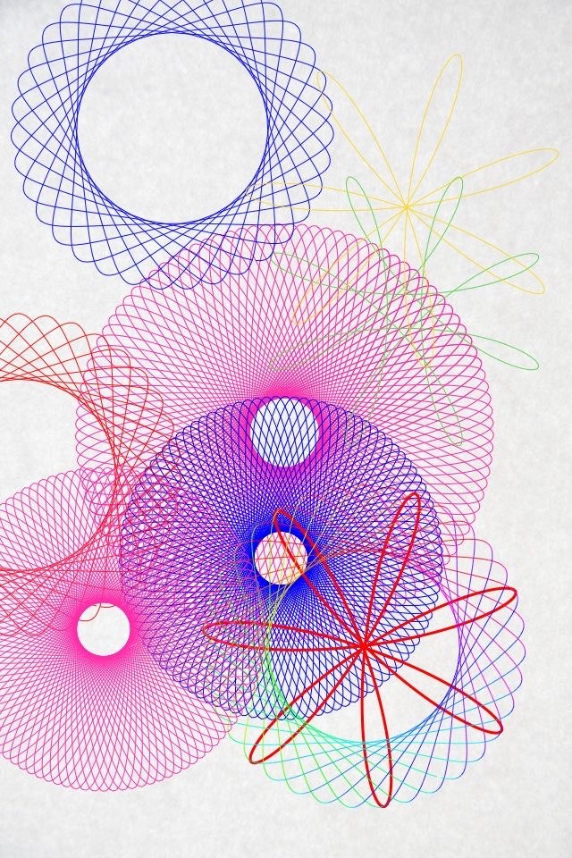

# Harmonic Loop Fields — primary visual reference



## Status and role

This image is a primary behavioral reference for a distinct Day Objects visual
family called **Harmonic Loop Fields**.

It demonstrates how a broad vocabulary of circle-derived forms can emerge from
one continuous parametric-path grammar. Hollow woven rings, dense radial bodies,
multi-lobed loops, open orbital bouquets, and asymmetric fans are different
phenotypes of related frequency, phase, amplitude, and closure relationships.

Apply the shared seed hierarchy, actor identity, compatibility, mutation
budget, and `SceneRecipe` boundary from
[`Day Objects Generative DNA`](../system/01-generative-dna.md). This document
defines the family-specific path geometry, line material, interaction,
composition, depth, and motion behavior.

The reference is not a pixel-perfect target. It does not prescribe exact
colors, coordinates, curve equations, actor count, line density, paper texture,
or the literal rosettes shown in the source. Preserve its system:

- one continuous path grammar produces visibly different related actors;
- frequency relationships determine lobes, openings, symmetry, and density;
- some actors read as hollow rings while others approach filled optical fields;
- actors differ strongly in scale, eccentricity, closure, and visual weight;
- transparent line crossings accumulate into richer local color and density;
- isolated actors balance a dense field of overlaps;
- color identifies complete path systems rather than individual crossings;
- path construction remains continuous and never becomes a visible point cloud.

## First perceptual read

The first read is an energetic field of large colored line structures. A broad
pink and violet mass dominates the lower and central canvas, while one separate
dark woven ring anchors the upper-left. A loose lighter multi-loop form opens
the upper-right and prevents the dense lower region from filling the complete
frame.

The second read reveals significant formal variety. The scene contains:

- a hollow annular rosette;
- a very large dense field with many narrow lobes;
- a compact blue-violet woven body with a large opening;
- a broad lower field with an offset circular void;
- a foreground red orbit bouquet with a small number of long petals;
- sparse green and yellow multi-loop gestures;
- cropped path systems entering from the left and bottom edges.

The third read reveals that these forms share one construction principle. Fine
continuous lines repeatedly cross themselves and their neighbors. Density,
color accumulation, and changing curvature create apparent volume without a
conventional filled surface.

## Core visual idea

The family is based on **one continuous path under harmonic repetition**.

A primary actor is generated by a parametric curve that combines a small number
of periodic components. Changing their relative frequencies, amplitudes, and
phases changes the complete form continuously.

This provides diversity without a lookup table of finished shapes:

- close frequencies create slow precession and woven annuli;
- wider frequency separation creates more lobes and denser crossings;
- unequal amplitudes stretch the body into an ellipse or fan;
- changing phase rotates or offsets the internal weave;
- incomplete traversal creates an open gesture;
- a broad inner radius creates a hollow ring;
- repeated crossings around the center create an optical disc;
- low lobe counts create large loop bouquets or restrained soft stars.

The shape is not selected as `flower`, `atom`, or `spirograph`. Those are
possible accidental readings that the generator must control. The selected
genes describe path behavior, and the phenotype emerges from them.

## What the reference adds to Generative DNA

### Harmonic-path geometry

A complete actor can be represented as one deterministic continuous curve or a
small family of tightly related continuous curves.

Its geometry is controlled by:

- base radius or extent;
- horizontal and vertical amplitude;
- primary and secondary frequency;
- frequency ratio;
- phase relationship;
- center offset;
- traversal duration;
- closure error tolerance;
- internal hole ratio;
- low-frequency envelope deformation.

### Repeated-path material

The actor becomes visible through a thin line traversing the harmonic path.
Where the path crosses or nearly repeats, optical density increases.

This is a construction mechanism, not a contour modifier. The repeated line
creates both the silhouette and the apparent interior field.

### Transparent curve superposition

Different actors can overlap while preserving their complete path identities.
Their lines create denser woven regions and new local color relationships.

### Density weave

Path spacing and crossing angle control whether a region reads as open linework,
a woven mesh, or an almost continuous optical field.

### Closure spectrum

A path may be exactly closed, nearly closed, or deliberately partial. Closure
is a stable actor trait rather than an animation artifact.

## Composition grammar

### Dense lower field and open upper field

Most visual weight occupies the lower two-thirds. Several large actors overlap
there, producing a rich central weave. The upper region remains more open and
contains two separated counterweights.

This asymmetry gives the scene direction and prevents the full canvas from
becoming one uniform tangle.

The generator may rotate or invert this weight distribution. Preserve the
contrast between one dense region and one open region.

### Isolated annular anchor

The large upper-left rosette is separated enough to reveal its complete
construction. It provides a calm readable example of the family before the eye
enters the dense overlap field.

Most scenes in this family benefit from at least one actor with limited overlap.
Otherwise, individual DNA mutations become impossible to perceive.

### Dominant woven field

One very large actor creates the main visual mass through high path density and
broad extent. It overlaps several other actors but remains identifiable by its
color role, scale, and recurring curvature.

The dominant field should not automatically be the actor with the highest line
count, largest radius, strongest color, and greatest overlap simultaneously.
Distribute visual weight across several parameters.

### Foreground loop bouquet

A lower-lobe-count actor crosses the dense field with a small number of long,
bold loops. It creates scale contrast in path frequency as well as actor size.

Only one or two actors should use such a conspicuous low-lobe regime in one
scene. Repetition would create a literal flower or atom pattern.

### Edge entries

Several actors continue beyond the left or lower frame. Their cropped paths
imply a larger field and keep the composition from becoming a centered poster.

Crop decisions must preserve enough of the path to communicate its regime.
A tiny unexplained arc at the edge looks accidental.

### Internal negative space

Holes inside woven rings and dense fields are part of the composition. They
expose the background and distinguish neighboring actors.

Internal openings should vary in:

- size;
- position;
- roundness;
- relation to the actor center;
- degree of path encirclement.

Avoid repeating the same centered circular hole, which produces targets or
identical rosettes.

### External negative space

Quiet paper-like background remains visible between the upper actors and around
selected edges. This space protects line legibility and balances the dense
lower weave.

Do not fill every quiet region with a small decorative loop.

## Scale hierarchy

The source uses a continuous scale spectrum:

- one very large field spanning much of the canvas;
- several large overlapping structures;
- medium orbit bouquets and annular forms;
- smaller sparse loop gestures;
- cropped structures whose full scale is implied.

Actor scale and internal lobe scale are separate variables. A large actor may
have a small number of broad loops, while a medium actor may have many fine
crossings.

Avoid coupling actor size directly to lobe count. That would make every small
actor simple and every large actor dense.

## Happening identity

One happening maps to one primary harmonic-path actor.

The actor may contain:

- one continuous closed path;
- one continuous partial path;
- a small set of phase-related path passes owned by the same identity;
- one stable internal opening;
- family-compatible depth or line-density variants.

Individual lobes, crossings, and repeated turns are not separate happenings.

Adding or removing another happening must not alter a surviving actor's:

- frequency ratio;
- phase;
- lobe regime;
- opening ratio;
- line width;
- color role;
- traversal completeness;
- motion phase.

Only bounded scene-level placement adjustments are permitted.

## Parametric path grammar

### Conceptual model

The implementation may use hypotrochoid-like, epitrochoid-like, Lissajous-like,
Fourier, or custom periodic equations. The exact equation is not the contract.

A conceptual representation is:

```text
x(t) = centerX + horizontalComponents(t, frequencies, phases, amplitudes)
y(t) = centerY + verticalComponents(t, frequencies, phases, amplitudes)
```

The path is evaluated continuously over a stable traversal interval. Samples
used by the renderer are invisible construction data, never visible dots.

### Frequency ratio

The relation between periodic components is the strongest topology control.

It influences:

- lobe count;
- apparent rotational symmetry;
- closure period;
- crossing density;
- internal opening size;
- whether the path reads as annular, radial, or orbital.

Use weighted families of ratios rather than unrestricted random numbers. Nearby
ratios can produce nearly indistinguishable forms, while poorly conditioned
ratios can create excessive traversal length or unstable aliasing.

### Amplitude relationship

Horizontal and vertical amplitudes control extent and eccentricity.

- equal broad amplitudes tend toward circular fields;
- moderate inequality creates ellipses;
- one dominant component creates elongated loops or fans;
- nested amplitude scales create outer loops with a quieter inner structure.

Amplitude should respond to actor role and available canvas space.

### Phase relationship

Relative phase rotates, twists, or shifts the weave without requiring a new
shape family.

Phase variation must be deterministic. Two actors with different seeds should
not repeatedly share the same visible orientation.

### Lobe regime

Lobe count is treated as a qualitative weighted region:

- low: a few broad loops or a soft-star tendency;
- medium: clearly woven rosette or orbit field;
- high: dense optical annulus or disc;
- very high: reserved and resolution-dependent.

One scene should use two or three related regimes rather than displaying the
complete spectrum.

### Opening ratio

The apparent inner void can range from broad to nearly closed.

- broad openings create annular anchors;
- medium openings reveal dense woven rims;
- small openings create concentrated optical fields;
- offset openings add asymmetry.

A small sharp centered hole risks becoming an eye or target. The transition
around the void must remain part of the line weave.

### Traversal completeness

The path may use:

- one exact closed period;
- several coherent passes;
- a near-complete period with a deliberate opening;
- a partial traversal forming a gesture or fan.

Partial paths require intentional taper or termination. They must not look like
failed closure or clipped geometry.

### Envelope deformation

A low-frequency envelope may alter radius or center position over the traversal.
This supports asymmetric fans and off-center woven fields.

High-frequency random deformation is prohibited because it creates scribbles,
hair, and unstable sampling.

### Line count versus path count

The viewer may perceive many lines even when the actor is one path repeatedly
crossing itself. The model should preserve this distinction.

Do not inflate visual diversity by stacking many unrelated paths inside one
actor. If multiple passes are used, they share a frequency family, palette role,
and stable phase relationship.

## Continuous outcome space

The following labels describe regions of one procedural space, not finished
presets.

### Woven annulus

A high-count path repeatedly crosses around a broad central opening. The outer
edge has a fine scalloped rhythm while the inner void remains calm.

### Dense optical disc

The opening ratio decreases and crossing density increases until the actor reads
as a colored body from far away while retaining line structure up close.

### Broad rosette

A medium lobe regime creates a readable radial weave with a moderate opening.
Lobe variation and asymmetry prevent a literal daisy.

### Orbit bouquet

A low lobe regime creates several long overlapping loops around a center. It is
an accent form, not the default actor.

### Elongated loop field

Unequal amplitudes stretch the path into an oval, fan, or diagonal gesture.

### Partial harmonic gesture

An incomplete traversal creates a small number of related arcs without closing
the complete body.

### Offset woven body

The apparent opening or density center shifts away from the geometric center.
The complete silhouette remains coherent.

### Compound phase field

Two or a few tightly related passes create a richer weave. Their relation is
stable and subordinate to one actor identity.

## Line material behavior

### Primary material

The primary construction is a **Repeated Path Field**. One thin continuous line
creates both contour and interior density through repetition and crossing.

### Line width

Line width remains relatively consistent inside one actor. Small controlled
variation may support depth or focus, but it should not imitate the junction
widening of Tensioned Loop Network.

### Opacity

Opacity must be coupled to path density. Dense actors use lower per-pass opacity
or careful compositing to prevent black or muddy centers. Sparse actors need
enough opacity to remain legible.

### Accumulation

Crossings create optical density. Accumulation should be smooth and predictable
in the target color space.

The renderer must not clamp dense crossings abruptly or create rectangular
blend artifacts.

### Grain

A subtle paper or screen grain may unify the scene. Grain is secondary to the
line weave and must not fragment paths into dots.

### Softness

Fine antialiasing and slight depth softness are permitted. Heavy blur destroys
the construction and turns dense actors into dirty color stains.

## Color behavior

The source uses several distinct contour colors. Exact hues are not the
contract.

Preserve these relationships:

- one or two large actors carry dominant color roles;
- an isolated anchor can use a contrasting or quieter identity;
- sparse gestures use accent roles selectively;
- each complete path actor keeps a coherent color identity;
- crossings may deepen or mix, but do not randomly recolor line segments;
- the background supports both fine lines and dense fields.

Avoid assigning a unique unrelated hue to every actor. The result would become
a rainbow geometry demonstration instead of one editorial composition.

Single-color paths remain truly single-color. Multicolor path behavior is not
part of the initial family profile. If explored later, it must use broad smooth
variation along the complete path, not alternating lobe colors.

## Interaction grammar

### Transparent superposition

Two complete path actors overlap while retaining their own geometry and color.
Crossing regions create a third optical state.

### Density weave

Different path orientations intersect to produce woven local density. The
interaction is strongest when crossing angles differ visibly.

### Partial occlusion

A stronger foreground path may dominate a weaker background actor, but the
background should remain recoverable around the overlap.

### Aperture framing

One actor's internal opening may frame part of another actor. This creates depth
without a conventional filled mask.

### Scale counterpoint

A low-lobe foreground bouquet may cross a dense high-lobe field. Their
difference in internal scale makes both actors clearer.

### Deliberate separation

At least one actor may remain mostly isolated to demonstrate family variety and
protect negative space.

### No relational deformation

Unlike Tensioned Loop Network, actors do not normally deform toward one another
or share boundaries. Their interaction comes from superposition, density, and
framing.

## Depth and focus

Depth is communicated through:

- actor scale;
- line density;
- opacity;
- overlap order;
- color contrast;
- selective focus;
- cropping.

Large near actors may be softer, but the line weave must remain recoverable.
Small distant actors need sufficient sampling stability to avoid becoming dark
blobs or disconnected marks.

Internal density is not itself a fixed depth cue. A dense actor can be near or
far depending on the complete role assignment.

## Family-specific DNA profile

### Primary geometry region

- harmonic closed path;
- near-closed path;
- partial harmonic path;
- annular, radial, elongated, or softly lobed extent;
- centered or offset opening;
- one or a few phase-related passes.

### Primary material construction

- Repeated Path Field.

### Compatible modifiers

- stable single-color line;
- path-density-aware opacity;
- light antialiasing and depth softness;
- restrained stable grain;
- broad background gradient.

### Common interaction region

- transparent superposition;
- density weave;
- aperture framing;
- scale counterpoint;
- deliberate separation.

### Supporting mutation region

- elongated loop field;
- offset opening;
- partial traversal;
- moderate low-lobe actor;
- cropped large field;
- two tightly related passes.

### Rare mutation region

- one very low-lobe orbit bouquet;
- one nearly filled optical disc;
- one unusually broad annular opening;
- one strongly asymmetric fan;
- one near-hairline isolated giant.

### Forbidden region

- visible point clouds;
- literal flower icons;
- repeated atom symbols;
- identical symmetric rosettes;
- security-pattern wallpaper;
- every available lobe regime in one scene;
- random color per lobe;
- hard gradient fills pasted behind the linework;
- rapid spinning;
- phase crawling and moire;
- disconnected path fragments;
- per-frame topology regeneration.

## Correlated randomness

Parameters must be sampled conditionally.

Examples:

- higher path density lowers per-pass opacity;
- a broad opening can support a denser outer weave;
- low-lobe actors use simpler color and fewer overlapping neighbors;
- highly eccentric actors receive more surrounding negative space;
- a dense scene reserves at least one readable isolated actor;
- very thin paths avoid the lowest-contrast palette role;
- very high lobe counts reduce motion amplitude;
- strong edge cropping preserves a recognizable path interval;
- an actor with several phase-related passes uses a simpler silhouette envelope.

## Mutation budget

Most actors should occupy a shared middle region. A ten-happening scene might
use:

- five or six common annular or radial fields;
- two or three supporting elongated, offset, or partial mutations;
- zero to two rare low-lobe or extreme-density actors.

These are qualitative proportions. The generator must not create a fixed row of
one example from every named outcome.

## One-happening behavior

One happening should produce one compositionally complete path actor. Suitable
regions include:

- a large asymmetrically placed woven annulus;
- a cropped dense optical field;
- a broad elongated path with a stable opening;
- one low-lobe gesture balanced by negative space.

It must not duplicate the actor merely to make the scene appear richer.

## Three-happening behavior

Three actors should demonstrate difference in scale or internal frequency while
retaining one family grammar.

A useful structure is:

- one anchor;
- one overlapping counterweight;
- one isolated or partially cropped accent.

Avoid three equal rosettes arranged as a triangle.

## Five-happening behavior

Five actors can establish one dense overlap group and one isolated counterweight.
Use at most one conspicuous orbit bouquet.

The internal openings should not align around a common center.

## Ten-happening behavior

Ten happenings may create a rich woven field similar in density to the source,
but the scene still needs hierarchy:

- one dominant field;
- one readable isolated actor;
- several differently scaled supports;
- limited low-lobe accents;
- protected external and internal negative space.

Ten actors must not become a catalog of ten equations.

## Motion translation

### Whole-actor motion

Slow translation, depth-based parallax, and gentle coherent scale breathing are
the safest motion behaviors.

### Phase breathing

A very small slow phase variation may alter the weave while preserving lobe
count, closure class, internal opening, and recognizable silhouette.

This is optional and must be rejected if lines crawl or the actor appears to
spin rapidly.

### Stable traversal

The path is fully present. Normal motion should not repeatedly draw and erase it
from beginning to end.

### Stable topology

Frequency ratios, traversal completeness, path count, and closure remain fixed.
An actor must not morph from ring to atom to flower during motion.

### Forbidden motion

- rapid local rotation;
- continuous fast phase precession;
- oscillating lobe count;
- path drawing used as constant activity;
- per-frame sample jitter;
- lines crawling through dense intersections;
- high-frequency pulsation;
- independent movement of individual lobes.

## Reduce Motion

With Reduce Motion enabled:

- freeze phase breathing and internal precession;
- remove or strongly reduce parallax;
- preserve the exact complete paths;
- preserve color, opacity, opening, and draw order;
- retain the same static composition;
- do not substitute simpler rosettes.

The result is the same artwork at rest.

## Appearance and removal

### Appearance

An appearing actor may fade in as a complete path and expand slightly from its
resolved center. Avoid repeatedly tracing the path from zero, which feels like
a drawing tool demonstration.

### Removal

A removed actor may fade and contract while preserving its complete path until
it disappears.

### Identity protection

Count changes must not:

- change surviving frequency ratios;
- rotate surviving paths to new phases;
- change colors;
- alter opening ratios;
- reorder unrelated layers;
- resample line density;
- regenerate the full composition.

## Full-screen and calendar tile

### Full-screen

Full-screen rendering should preserve:

- continuous fine lines;
- small spacing differences;
- accumulation at crossings;
- internal openings;
- actor-to-actor color identity;
- readable depth order.

### Calendar tile

At calendar-tile scale, literal high-frequency linework may alias. A scale-aware
representation may reduce effective frequency or analytically integrate dense
regions, provided it preserves:

- the same macro silhouette;
- opening position and size;
- dominant density pattern;
- actor color identity;
- overlap order;
- continuous rather than dotted line appearance.

The tile is a derived rendering of the same phenotype, not a separately seeded
shape.

## Rendering considerations

### Adaptive path sampling

Curve sampling should respond to local curvature and target resolution. Uniform
undersampling creates polygonal lobes; uncontrolled oversampling wastes memory
and can worsen overdraw.

### Antialiasing

Fine paths must remain continuous and stable. Multisampling, analytic coverage,
or another suitable method should prevent gaps and stair steps.

### Overdraw and density

Dense actors may cross themselves hundreds of times. The renderer should bound
overdraw or evaluate accumulated density analytically where appropriate.

Visual path density and raw geometry count should be decoupled when possible.

### Moire and temporal stability

Closely spaced curves are vulnerable to moire, false color, and shimmer.
Validation must use actual full-screen and tile sizes during motion.

If stable internal motion cannot be guaranteed, freeze the path and move only
the complete actor.

### Color-space compositing

Transparent crossings must be evaluated in the intended color space. Incorrect
blending can produce dirty intersections even when the selected palette is
compatible.

## Negative signatures

Reject a generated scene if it shows:

- identical rosettes with only color or scale changed;
- literal daisies, flowers, atom symbols, or toy spirographs;
- regular security-print wallpaper;
- a rainbow allocation of unrelated line colors;
- every actor sharing one center;
- equal lobe counts and orientations;
- dense line tangles with no recoverable actors;
- sharp centered holes that read as pupils or targets;
- hard fills concealing the path construction;
- disconnected dots or visible sampling points;
- polygonal curves caused by undersampling;
- moire, shimmer, crawling, or false color;
- rapid rotation or continuous path drawing;
- a centered upper-only cluster;
- insufficient negative space;
- the complete outcome catalog in one scene.

## Acceptance checklist

### First read

- [ ] The scene reads as one editorial field of related line actors.
- [ ] There is a clear dominant mass and at least one quieter counterweight.
- [ ] Scale and internal frequency vary independently.
- [ ] The composition does not resemble a geometry demonstration.

### Geometry

- [ ] Every actor derives from the shared continuous path grammar.
- [ ] Actors differ through parameters rather than finished presets.
- [ ] Openings, eccentricity, lobe regime, and closure vary visibly.
- [ ] Low-lobe actors remain abstract rather than literal flowers or atoms.
- [ ] No visible point-cloud phenotype appears.

### Material

- [ ] Fine paths remain continuous.
- [ ] Density accumulation creates optical fields without muddy collapse.
- [ ] Each path actor maintains coherent color identity.
- [ ] Grain and softness remain subordinate to line structure.
- [ ] Dense and sparse actors both remain visible.

### Composition and interaction

- [ ] Dense overlaps are balanced by readable isolated actors.
- [ ] Internal and external negative space remain active.
- [ ] Cropped actors preserve a recognizable path interval.
- [ ] Superposition creates depth without merging actor identities.
- [ ] No common center, grid, or equal rosette row appears.

### Procedural behavior

- [ ] One seed reproduces frequency, phase, amplitude, and closure exactly.
- [ ] Actor identities survive insertion and removal of other happenings.
- [ ] Parameter correlations prevent incoherent extremes.
- [ ] Rare shapes stay inside the scene mutation budget.
- [ ] One primary family remains identifiable.

### Motion

- [ ] Whole-actor motion is slow and depth-dependent.
- [ ] Optional phase breathing preserves topology and silhouette.
- [ ] Dense lines do not crawl, shimmer, or spin rapidly.
- [ ] Reduce Motion shows the same artwork at rest.

### Target sizes

- [ ] Full-screen preserves line weave and crossing density.
- [ ] Calendar tile preserves macro silhouette and openings.
- [ ] Scale-aware sampling never becomes disconnected dots.
- [ ] Both sizes express the same frozen phenotype.

## Relationship to other families

### Linework Constellation

Both families use fine circular linework and varied open forms.

Linework Constellation assembles a scene from several topological constructions:
rings, arcs, woven annuli, radial thread bodies, and satellites. Harmonic Loop
Fields generates each actor primarily from one repeated continuous path grammar.

Do not import the complete Linework Constellation catalog into this family.

### Radial Fiber Fields

Radial Fiber Fields builds actors from many radial fibers between inner and
outer envelopes. Harmonic Loop Fields uses a path that travels around and across
the actor repeatedly.

Both can produce optical density, but their directional microstructure is
different and should remain legible.

### Tensioned Loop Network

Tensioned Loop Network creates relational deformation and shared boundaries.
Harmonic Loop actors normally preserve their geometry through overlaps.

Do not add tension bridges simply because two harmonic actors intersect.

### Editorial Gradient Overlap

Editorial Gradient Overlap uses broad filled radial color fields. Harmonic Loop
Fields is line-led and mostly exposes the background between paths.

A broad quiet gradient background is compatible. Filling every harmonic actor
with an additional complex gradient is not part of the initial profile.

## Suggested future generator experiment

Use a fixed composition, background, line width, and restrained palette. Create
a seeded shape-space sheet varying only:

1. frequency-ratio family;
2. lobe regime;
3. amplitude relationship;
4. opening ratio;
5. phase;
6. traversal completeness.

The sheet should demonstrate that these parameters create broad related variety
without relying on named finished presets. It should exclude motion, heavy
grain, gradient fills, and multi-family interaction until the path grammar is
approved.

After shape-space approval, test the family in independent composition seeds
with 1, 3, 5, and 10 happenings.

## Compact family profile

```text
family: harmonicLoopFields
primaryGeometry: harmonicPathBody
primaryMaterial: repeatedPathField
composition: denseFieldWithIsolatedCounterweight
dominantInteractions: transparentSuperposition, densityWeave, apertureFraming
pathIdentity: stableFrequencyPhaseAmplitudeClosure
edge: continuousHairlinePath
color: coherentSingleColorPerActor
motion: slowWholeActorWithOptionalMinimalPhaseBreathing
forbidden: pointCloud, literalFlower, atomIcon, moire, rapidRotation
```

Exact names are not implementation requirements. The profile records the
behavior that a future generator must express.

## Final rule

The reference is valuable because broad formal variety emerges from one
continuous procedural language.

Do not save the visible rosettes as assets. Generate stable harmonic paths whose
frequency, phase, amplitude, opening, and traversal relationships create many
different but unmistakably related actors.
