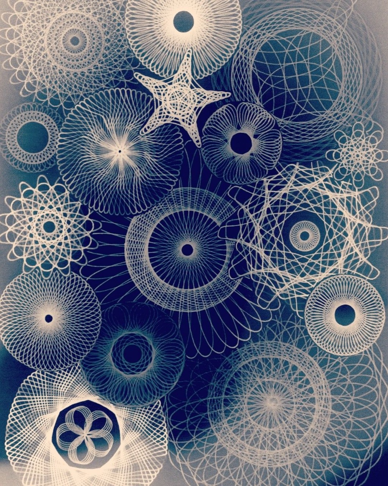

# Harmonic Weave Construction — supporting visual reference

## Status and role

This image is a supporting construction reference for the existing
**Harmonic Loop Fields** family. It does not introduce a catalog of finished
ornaments. It extends the family's procedural grammar so one repeated path can
form circular, annular, softly starred, rounded-polygon, and rounded-square
actors.

Apply the seed hierarchy, stable happening identity, family coherence,
compatibility rules, and frozen phenotype boundary from
[`Day Objects Generative DNA`](../system/01-generative-dna.md). Apply the path
behavior and anti-flower rules from
[`Harmonic Loop Fields`](./07-harmonic-loop-fields-reference.md).

The source is not a composition target. Preserve the existing Editorial Field
placement, scale, depth, overlap, crop, focus, and negative-space decisions.
Borrow only the way a repeated trajectory constructs an actor.

## Core observation

The reference does not draw a carrier and then decorate its interior. A family
of phase-related trajectories simultaneously creates:

- the perceived silhouette;
- an open or dense interior;
- an optional aperture;
- local optical value through line accumulation;
- edge character;
- a continuous relationship between circles, stars, and rounded polygons.

The important primitive is therefore not `star`, `square`, or `rosette`. It is
a **circle-derived envelope traversed by a repeated harmonic path**.

## Procedural construction

### Carrier envelope

Every actor begins in a circular coordinate system. A low-frequency radial
envelope can continuously move among:

- circle or ellipse;
- softly lobed circle;
- restrained soft star;
- rounded polygon;
- rounded square.

Corners and lobes remain curved. No actor becomes a sharp icon, badge, gear,
literal flower, or pasted vector symbol.

### Harmonic path

One deterministic path combines a small number of periodic components. Its
primary controls are:

- primary lobe frequency;
- secondary weave frequency;
- relative phase;
- eccentricity;
- radial amplitude;
- exact, near, or partial closure.

The implementation may use a polar interference field, hypotrochoid-like
curve, epitrochoid-like curve, Lissajous-like curve, Fourier path, or another
continuous equivalent. The rendered phenotype matters more than the literal
equation.

### Phase-related passes

An actor may contain one path or a bounded family of related passes. Additional
passes use small deterministic phase offsets and retain the same carrier,
frequency regime, palette role, and identity.

Passes must read as one woven actor. They must not look like unrelated rings
stacked on top of one another.

### Density and aperture

Density varies independently from actor size. A large actor can use a few
broad loops, while a smaller actor can contain a denser weave.

The inner aperture is a first-class parameter. It may be absent, broad,
slightly offset, surrounded by a dense annulus, or partially opened by an
incomplete traversal. Avoid repeating small centered holes: they create
pupils, targets, buttons, and identical rosettes.

### Line material

The line is continuous, antialiased, and stable. Its width, opacity, and
spacing are correlated:

- denser weaves use finer or more transparent lines;
- sparse actors use slightly stronger lines;
- foreground softness may merge neighboring lines into an optical field;
- small tile actors use a lower-frequency representation rather than unstable
  one-pixel detail.

Line color belongs to the complete actor. One-color actors remain genuinely
one-color. Multicolor actors may use the approved broad, smooth radial color
fields along the weave, never angular wedges or hard bands.

## Scene-level coherence

One generated day chooses one harmonic-weave dialect. The shared dialect owns
a bounded frequency-ratio region, common line character, related density
range, aperture tendency, palette relationship, and softness regime.

Individual actors mutate only a few dimensions inside that dialect: carrier
envelope, scale, lobe count, aperture, density, phase, and traversal closure.
This produces clear variety without turning a ten-happening day into a specimen
catalog.

Only one or two actors in a ten-happening scene may use a conspicuous low-lobe
star or bouquet. Most actors should remain circular, annular, or softly
deformed so circle remains the visual root.

## Relationship to existing families

### Harmonic Loop Fields

This reference extends that family. It adds envelope-conditioned paths,
phase-related multipass construction, and clearer rounded-square or soft-star
phenotypes. It does not require a separate top-level family.

### Radial Fiber Fields

Both can create optical bodies from repeated lines. Radial Fiber Fields is
primarily center-to-edge and spoke-like; Harmonic Weave is tangential,
orbiting, and self-crossing. A generated day chooses one as its dominant
construction rather than combining both complete grammars.

### Editorial Gradient Overlap

Editorial Field remains the composition and depth authority. Gradient fields
may color the woven line system, but a weave day should not also display the
complete catalog of solid, glass, halo, counterform, and outline recipes.

## Motion

The path identity is frozen when the scene is created. Normal motion uses the
existing slow whole-actor drift, depth, and parallax. A very small coherent
phase drift is permitted only when it does not cause shimmer.

Avoid rapid local rotation, continuously spinning rosettes, per-frame path
resampling, changing frequency ratios, crawling moire, and morphing between
circle and star during normal motion. Reduce Motion shows the same generated
weave at rest.

## What not to copy

- the literal white-on-blue palette;
- the catalog-like full-frame packing;
- the exact ornaments or equations;
- repeated centered targets;
- literal flowers, gears, atoms, or badges;
- identical radial symmetry across all actors;
- high-frequency detail that disappears or flickers at calendar-tile size.

## Lab MVP acceptance

- The same day and event IDs reproduce the same dialect and actor parameters.
- Adding or removing a happening does not reroll surviving weaves.
- A sampled day can visibly contain circles, annuli, soft stars, rounded
  polygons, and rounded squares without leaving the circle-derived universe.
- All actors in one weave day share one line character and frequency region.
- One-, two-, and three-color assignments remain broad and smooth.
- Ten happenings retain Editorial Field hierarchy, cropping, depth, and
  negative space rather than reproducing the reference's catalog layout.
- The full-screen image remains stable and the tile representation does not
  crawl, sparkle, or collapse into random noise.
- The feature remains available only inside Day Objects Lab.

