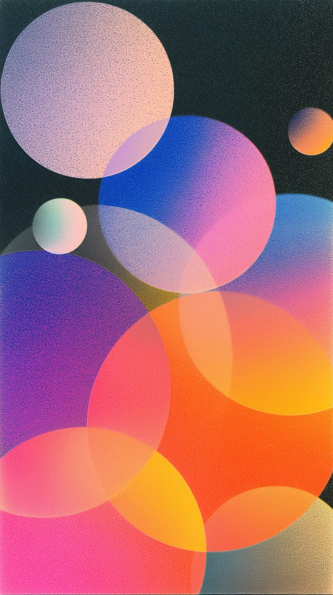

# Editorial gradient overlap — primary visual reference

## Status and role

This image is a primary behavioral reference for the experimental Day Objects
Editorial Field. It is not a pixel-perfect target and it does not prescribe a
specific palette, object count, or set of coordinates. Its value is the system
of relationships it demonstrates:

- materially distinct circular fields that still belong to one visual world;
- broad, continuous gradients that occupy the complete object;
- transparency used to create meaningful new shapes and colors at overlaps;
- an asymmetric composition with strong scale hierarchy and deliberate
  negative space;
- a dense, stable print-like grain that unifies background and objects;
- vivid color without small hard-edged inserts, central pupils, or pasted-on
  highlights.

Use this reference when evaluating material diversity, palette allocation,
overlap behavior, grain, and the overall editorial quality of a generated
scene. Existing approved Day Objects composition work remains valid; this
reference adds a clearer target for how color fields and intersections should
behave inside that system.

Apply the shared seed hierarchy, actor identity, compatibility, mutation
budget, and `SceneRecipe` boundary from
[`Day Objects Generative DNA`](../system/01-generative-dna.md). This document
defines the family-specific gradient, transparency, grain, and composition
behavior.

## First perceptual read

The image reads first as a vertical field of large colored masses, not as a
collection of individual icons. A few large objects establish the composition,
medium objects connect them, and small satellites punctuate open areas. The
eye travels through an irregular sequence of overlaps rather than following a
grid, a ring, a flower, or a centered cluster.

The scene feels varied because every major object has a different internal
color relationship. It feels coherent because hues recur across the canvas,
the same granular surface covers the full image, and all objects share the
same circular geometry and compositing logic.

The desired result is therefore not “many unrelated circle styles.” It is one
visual language with materially different members.

## Composition grammar

### Asymmetry

The composition must not have one common center. Large masses should pull the
eye in different directions and be counterbalanced by smaller satellites or
open space. Avoid bilateral symmetry, radial balance, evenly spaced rows, and
repeated diagonals.

### Scale hierarchy

A successful full-screen scene should normally contain at least four visibly
different scale levels:

1. a cropped giant or near-foreground field;
2. one or more large anchors;
3. medium connecting objects;
4. small or tiny distant accents.

The diameter spectrum should feel continuous rather than selected from two or
three obvious presets. As a starting range for a portrait canvas:

- giant: approximately 55–85% of the canvas width;
- large: approximately 35–60%;
- medium: approximately 18–35%;
- small: approximately 7–18%.

These are guidance bands, not quotas. A scene may omit one band when the
result still has an unmistakable depth hierarchy.

### Edge cropping

Objects are allowed and encouraged to continue beyond the canvas. Cropping
should occur on several different edges, not repeatedly on only the bottom or
top. Cropped forms imply a larger world and prevent the canvas from reading as
a tray containing neatly placed tokens.

For scenes with seven to ten objects, aim for at least two or three meaningful
edge crops. Do not crop every actor; some complete silhouettes are needed to
make the scale relationships legible.

### Overlap network

Overlap is a structural part of the composition. It should connect the scene
into a field rather than produce one dense knot. Prefer a loose chain or
network in which different pairs meet at different depths.

Useful overlap shapes are broad lenses and substantial shared areas. Tiny
tangencies and barely touching edges look accidental. Identical overlap ratios
look procedural. Some actors should remain isolated to preserve rhythm and
breathing room.

### Negative space

The reference retains a substantial region of calm background around the
upper and side areas even though the lower field is dense. A generated scene
should similarly preserve at least one meaningful quiet region. Negative space
does not need to be empty of all small accents, but it must remain visually
subordinate to the main mass.

Do not distribute objects merely to maximize uniform coverage. Visual weight,
not occupancy percentage, determines balance.

## Material taxonomy

Material families must be distinguished by construction, not by small changes
in opacity or blur. Transparency, focus, and edge softness are parameters that
can vary within a material family.

The reference supports the following useful constructions:

### Uniform solid field

- Exactly one color across the body.
- No internal light spot, tonal pupil, central glow, or faux gradient.
- May use a small amount of global transparency when an overlap requires it,
  but remains perceptually flat.
- Best used sparingly as an anchor or small accent among gradient fields.

### Two-color radial field

- Two visibly distinct but compatible colors.
- Both colors contribute to a large portion of the object.
- The transition spans the diameter rather than forming a small colored spot.
- The result may appear directionally washed, but must still be constructed
  only from smooth radial fields.

### Three-color radial field

- Three related colors with different roles: anchor, counter-field, and
  accent field.
- All boundaries are broad and continuous.
- The third color must enrich the complete body rather than appear as a small
  sticker or isolated dot.
- No angular wedges, conical transitions, linear bands, pyramids, or hard
  borders are permitted.

### Outline field

- Optional, not dominant in this specific visual language.
- May use a soft substantial contour or a very thin hairline contour.
- The empty center must read as intentional negative space, not as a missing
  texture, broken render, or eye.
- A ten-object scene should normally contain no more than one outline unless
  the day is explicitly an outline-focused variant.

“Translucent solid,” “mist,” and “transparent multicolor” are not separate
material families here. They describe parameter ranges within the constructions
above and must not inflate the apparent diversity of the material catalog.

## Gradient grammar

### Field size

Gradient fields must be broad. Their effective radius should be comparable to
or larger than the object radius. The viewer should perceive a gradual change
across the full circle, not a colored core surrounded by another color.

For two-color objects, each field should normally influence at least one third
of the visible body. For three-color objects, fields should overlap enough that
no color reads as a hard isolated island.

### Shifted centers

Radial centers should be offset from the geometric center. Strong results often
place one or more centers close to the edge or beyond the object boundary. This
creates a calm directional wash while remaining compatible with the radial-only
material contract.

Do not reuse the same center arrangement for every actor. Vary orientation,
distance from center, field radius, and the relative strength of each field.
These variations must be deterministic for a stable day and actor identity.

### Smoothness

Transitions must remain continuous under close inspection and at calendar-tile
size. There should be no visible contour bands, angular boundaries, hard masks,
or sudden hue jumps. Smoothness must come from the field construction itself,
not from heavy whole-object blur that destroys the silhouette.

### Perceptual separation

Two- and three-color fields need enough perceptual separation to be obvious on
a phone. A light and dark version of one hue is not sufficient to represent the
full gradient family. At the same time, colors must be selected as a coherent
combination rather than independently randomized.

The source palette is the authority. A material may select one, two, or three
members of an approved palette or a prevalidated related palette pair. It must
not synthesize arbitrary unrelated hues merely to increase diversity.

## Palette behavior without literal colors

The exact hues in the reference are not requirements. Preserve the following
relationships instead:

- both warm and cool regions may coexist in one scene;
- pale fields counterbalance saturated anchors;
- small accents may carry unusually vivid color;
- one or two hues may recur to connect distant parts of the canvas;
- no single dominant hue should make most actors look cloned;
- neighboring large actors should not repeatedly use the same color pair in
  the same orientation;
- a scene of eight to ten actors should usually expose several clearly
  different dominant color identities at first glance.

The background and object colors must be selected together. Contrast is a
constraint, not the sole optimization target. A solver that always chooses the
highest-contrast primaries will produce repetitive red/blue/purple fields even
when the underlying catalog is large.

Adjacent generated days should exercise different regions of the approved
palette library. Deterministic scheduling is preferred over independent random
selection because it can prevent short-run repetition while remaining fully
reproducible.

## Transparency and compositing

Transparency is successful when an intersection produces a readable new color
and a meaningful lens shape. It is unsuccessful when it merely makes the actor
look faded.

Preserve these behaviors:

- large anchors remain strong enough to hold the composition;
- selected actors allow underlying color to participate in broad overlaps;
- overlap colors stay chromatic and intentional rather than brown, gray, or
  unexpectedly dark;
- silhouettes remain identifiable through the intersection;
- opacity varies by actor and depth instead of being globally identical;
- the same actor keeps its opacity and material identity when other events are
  added or removed.

Pairwise color compatibility should be evaluated with the actual compositing
model. Avoid relying on blur or grain to conceal muddy intersections. When a
palette pair cannot form clean overlap colors, select a different pair or make
one actor more opaque.

Transparency should not become a universal effect. A mix of stronger and more
permeable objects gives the overlap network hierarchy.

## Depth and focus

Depth is communicated first through scale, occlusion, crop, and opacity. Blur
is a supporting cue.

- Small distant actors should be comparatively focused.
- Large near actors may be softer, but their gradient direction, silhouette,
  and color identity must remain legible.
- Local blur must not turn every large object into an indistinct blob.
- Different depth layers should not receive identical blur.
- Grain should remain visible after local blur so the scene keeps one tactile
  surface.

The reference is sharper than the current Lab foreground treatment. When
adapting it to the approved Day Objects depth rule, use the minimum additional
blur needed to suggest proximity.

## Grain and surface

The grain is dense, evenly distributed, and print-like. It covers the background
and colored fields so that separate layers feel physically related.

Desired properties:

- visible at normal phone viewing size without becoming the primary subject;
- fine-to-medium particles at output resolution, densely packed rather than a
  few oversized digital blobs;
- stable in position over time, with no crawling, sparkling, or high-frequency
  animation;
- stronger visibility over broad light or saturated fields, but never strong
  enough to destroy the gradient;
- consistent global scale across the canvas;
- applied after the main color compositing and local depth blur so texture does
  not disappear from near objects.

Grain must not be used to disguise banding, hard gradient seams, low-resolution
rendering, or dirty palette combinations.

## Background behavior

The reference uses a calm, low-chroma background to support vivid actors and
negative space. Day Objects may retain its approved gradient backgrounds, but
the background gradient must operate at a much lower spatial frequency than
the actor gradients.

The background should:

- provide one quiet region for visual rest;
- preserve readable silhouettes and overlap colors;
- avoid competing focal spots behind the main actors;
- carry the same stable grain as the foreground;
- remain materially continuous behind cropped and translucent objects.

## Motion translation

The source is static, so motion should preserve its compositional qualities
rather than invent new local animation.

- Move complete actors through slow continuous drift.
- Use depth-dependent amplitude and parallax.
- Give actors individual periods and phases while retaining a weak shared
  directional tendency.
- Keep internal gradient centers almost stationary relative to their actor, or
  move them much more slowly than the actor itself.
- Do not rotate local gradients quickly.
- Preserve important overlap lenses for long enough to be perceived.
- Keep grain stable in screen or material space; it must not shimmer.
- Reduce Motion freezes translation, parallax, gradient phase, and grain drift
  while preserving the exact static composition.

## Deterministic generative rules

The following properties should be stable functions of the day and actor
identity:

- material construction;
- palette subset;
- gradient field centers, radii, and strengths;
- opacity and edge softness;
- depth, blur, and motion phase.

Adding or removing an event must not restyle surviving actors. Different days
may assign a different material to the same ordinal event; identity stability
is required within a scene lifecycle, not across unrelated days.

A grid of consecutive days must vary material distribution as well as
background palette. Reusing the same event IDs must not force every tile to
repeat the same arrangement of solids, gradients, and outlines.

## Suggested distribution for a mixed ten-object scene

This is a visual starting point, not a permanent quota:

- one or two uniform single-color fields;
- four or five two-color radial fields;
- two or three three-color radial fields;
- zero or one outline field.

Most visible area should therefore come from gradient objects. Opacity and blur
variations do not count as additional material categories.

## Acceptance checklist

Evaluate full-screen and calendar-tile renders at a glance, then inspect the
full-resolution frame.

### Two-second read

- [ ] The image reads as one editorial field, not as a set of icons.
- [ ] At least three scale levels are immediately apparent.
- [ ] Several objects have clearly different dominant color identities.
- [ ] Gradient actors are visibly gradients without looking like eyes.
- [ ] At least one quiet background region balances the dense mass.
- [ ] Overlaps contribute to the composition rather than looking accidental.

### Material inspection

- [ ] A one-color object is truly uniform inside its silhouette.
- [ ] Two-color fields expose both colors across substantial areas.
- [ ] Three-color fields remain smooth and coherent.
- [ ] Gradient centers are offset and not repeated mechanically.
- [ ] No angular, linear, conical, pyramidal, or hard-edged transition appears.
- [ ] Outline objects, when present, are intentional and rare.
- [ ] No inner pupil, circular hole, central glow, or pasted-on color spot is
      mistaken for a material feature.

### Palette and overlap inspection

- [ ] The canvas does not collapse into the same few dominant object colors.
- [ ] Adjacent large actors do not reuse the same color pair and orientation.
- [ ] Intersections create clean, readable lens colors.
- [ ] Transparency does not make important objects disappear.
- [ ] Background and actor palettes feel selected as one system.

### Texture and depth inspection

- [ ] Grain is visible, dense, stable, and consistent across layers.
- [ ] Grain does not hide seams or overpower color fields.
- [ ] Large near objects are softer than small distant objects without becoming
      colorless or illegible.
- [ ] Small actors remain focused and useful.
- [ ] Reduce Motion produces the same static appearance without shimmer.

### Corpus inspection

- [ ] Consecutive days vary object materials, not only positions and background.
- [ ] The palette library is visibly exercised over a short grid.
- [ ] No regular ring, row, grid, flower, or centered cluster emerges.
- [ ] Surviving actor identities remain stable through insertion and removal.

## Negative signatures

Reject a render when any of the following dominates:

- most actors are visually equivalent filled circles;
- most actors use the same dominant hue or color pair;
- a gradient is visible only as a small central spot;
- material variety exists in metadata but cannot be perceived in the image;
- opacity differences are presented as different material families;
- intersections become dirty, gray, or unexpectedly dark;
- foreground blur erases gradient structure and grain;
- grain crawls during motion or appears as isolated oversized pixels;
- the composition forms a grid, ring, flower, uniform row, or central heap;
- outlines and holes outnumber color fields;
- high contrast is achieved at the expense of palette variety and harmony.

## What not to copy literally

- the exact colors or their numeric values;
- the exact number, size, or position of circles;
- the exact overlap silhouettes;
- the precise amount of grain in the source file;
- any directional gradient implementation that violates the radial-only
  production contract;
- the same density and lower-heavy composition for every generated day.

Copy the relationships: broad gradients, varied object-local palettes,
intentional transparency, asymmetric scale hierarchy, tactile grain, clean
overlaps, and meaningful negative space.
