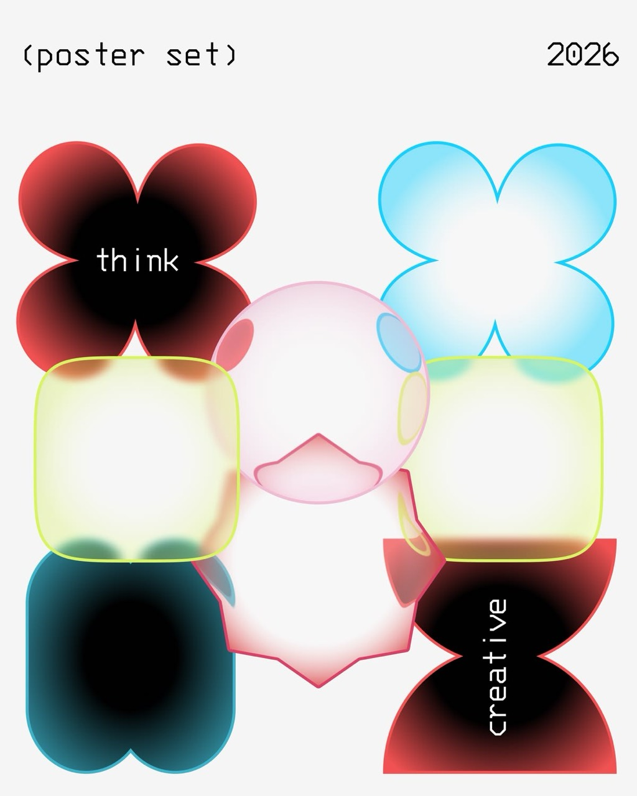

# Soft Constructed Body Atlas — cross-family visual reference



## Status and role

This image is a cross-family geometry-and-material reference for Day Objects
called **Soft Constructed Body Atlas**.

Unlike the family-specific references, this image should not become one visual
family whose complete vocabulary appears in every generated day. It is a
specimen poster showing several compatible carrier geometries, material
constructions, boundary treatments, and local field behaviors.

Apply the shared seed hierarchy, identity rules, compatibility system,
mutation budget, and `SceneRecipe` boundary from
[`Day Objects Generative DNA`](../system/01-generative-dna.md). This document
extends the shared vocabulary and defines compatibility rules. A selected
production family decides which subset is valid in one scene.

The reference is not a composition target. Do not copy its poster grid,
typography, labels, date, equal specimen scale, or centered presentation.

Preserve its systemic contribution:

- circle-derived primitives can form several soft compound carriers;
- geometry and material remain separately seedable;
- one material construction can transfer across compatible carriers;
- broad color fields can respond to lobes, clefts, corners, and boundary sites;
- chromatic outlines participate in material identity;
- translucent layers may overlap without losing the carrier silhouette;
- texture, softness, opacity, and saturation remain modifiers rather than an
  inflated list of pseudo-material families;
- compatibility constraints prevent arbitrary effect mixing.

## First perceptual read

The image reads as a poster-sized collection of soft graphic bodies. Several
forms recur in different material treatments, making the viewer notice both
shape and surface.

The strongest contrast comes from dark-core bodies with saturated colored
perimeters. Other actors are nearly empty: a thin chromatic outline surrounds a
light translucent interior with broad color haze close to selected edges.

The central body is rounder and more transparent, with attached or overlaid
colored membrane patches. A lower central shape introduces softly angled
vertices. Together these examples demonstrate that the material system need not
be tied to a perfect circle.

The source also contains typography. Text is part of the poster design and is
not a Day Objects material, happening, or procedural shape feature.

## Why this is an atlas rather than one family

The source intentionally presents materially different specimens:

- dark chromatic vignette;
- luminous outline with pale interior;
- boundary-attached color pools;
- translucent membrane with local overlays;
- soft angular shell;
- several compound carrier geometries.

Showing all of them together is useful for comparison but would violate the
Generative DNA rule that one day selects one primary visual family.

The atlas therefore has two responsibilities:

1. define reusable geometry genes;
2. define material constructions and their compatibility with those genes.

It does not define how many of each specimen should appear in one scene.

## Separation of carrier and material

### Carrier

The carrier is the continuous silhouette or boundary region owned by an actor.
It answers:

- what is the outer shape;
- where are lobes and clefts;
- whether the body has interior apertures or inset regions;
- how rounded or angular the contour is;
- which geometric features can anchor material fields.

### Material

The material answers:

- how color occupies the carrier;
- whether the interior is opaque, translucent, or membrane-like;
- whether color concentrates near the boundary or spans the whole body;
- how the outline relates to the fill;
- how grain and focus modify the result;
- how overlapping actors composite.

### Compatibility

Not every carrier supports every material equally. A family profile selects a
compatible pair and constrains both.

The same carrier can receive different materials on different generated days.
The same material can be transferred across related carriers. Within one day,
actors use related mutations of the selected pairing.

## Geometry vocabulary

### Soft compound body

The shared geometric principle is a body assembled from circle-derived lobes,
rounded rectangles, arcs, and broad smooth unions or subtractions.

The construction may use analytic curves, signed-distance operations,
parametric contours, or another deterministic method. The visible result must
remain continuous and soft.

Do not store the specimens as fixed SVG paths.

### Four-lobe body

Four broad circular lobes meet around a compact center, creating a clover-like
outer silhouette and four concave clefts.

Useful parameters:

- lobe radius;
- horizontal and vertical lobe spacing;
- cleft depth;
- union softness;
- overall aspect ratio;
- rotational offset;
- symmetry deviation;
- corner roundness at the clefts.

The form should not automatically read as a literal flower. Slight asymmetry,
unequal axes, crop, overlap, and non-floral material behavior help maintain an
abstract reading.

### Paired-lobe body

Two large lobes connect vertically or horizontally. Depending on separation and
contour treatment, the outcome may resemble:

- a soft figure eight;
- a bow tie;
- an hourglass;
- two opposing bowls;
- a broad two-part membrane.

The center connection must remain wide and soft enough to avoid a brittle knot.

### Rounded rectangular body

A broad rounded square or rectangle provides a calmer carrier that contrasts
with multi-lobed shapes.

Parameters include:

- width-to-height ratio;
- corner radius;
- superellipse exponent or equivalent curvature control;
- side bow;
- subtle asymmetry;
- optional cleft count;
- edge softness.

Avoid identical app-icon tiles arranged in a grid.

### Cleft rounded body

A rounded body may have one or more circle-derived concave notches. In the
source, a lower cleft turns a rounded rectangle into a paired-lobe silhouette.

Cleft parameters include:

- side assignment;
- width;
- depth;
- local roundness;
- symmetry relationship;
- distance from the nearest corner;
- influence on material anchors.

A cleft is part of geometry, not a dark spot painted on top.

### Soft angular shell

A closed contour can include several broad directional changes while retaining
rounded vertices and curved sides. The lower central specimen suggests a
pentagonal or shield-like body without becoming a hard polygon.

The shape should be constructed from a small number of smooth directional
features rather than sharp line segments.

Parameters include:

- feature count;
- radial feature amplitude;
- vertex roundness;
- side curvature;
- vertical bias;
- symmetry deviation;
- local indentation.

### Circular membrane with inset sites

A circular or near-circular carrier may own a limited number of broad local
inset regions attached to its boundary or interior.

Inset sites can be used for:

- translucent color overlays;
- a local aperture;
- an edge-attached secondary membrane;
- a structural notch;
- a broad material anchor.

Their placement must avoid face-like arrangements. Two symmetric side patches
plus one lower patch can easily read as eyes and a mouth.

### Asymmetric compound body

Lobe size, spacing, or cleft depth may vary so the carrier feels grown rather
than mirrored. Asymmetry must remain coherent and low-frequency.

Do not jitter every control sample independently.

## Geometry construction grammar

### Primitive set

The initial primitive set is deliberately small:

- circle or ellipse;
- rounded rectangle or superellipse;
- smooth arc;
- soft radial envelope;
- broad subtractive circle or arc for clefts;
- optional inset contour owned by the same actor.

This set can generate many outcomes without introducing arbitrary icons.

### Smooth union

Overlapping positive primitives combine into one body. The union region should
have controlled curvature and no visible hard Boolean seams.

Union softness affects identity:

- broad union produces one continuous organic body;
- tighter union preserves clearer individual lobes;
- overly tight union creates pinched flowers or disconnected bubbles;
- overly broad union erases the intended geometry.

### Smooth subtraction

Negative primitives create clefts, apertures, or broad notches. Subtraction
must remain soft and structurally plausible.

Small centered subtraction is discouraged because it creates pupils, targets,
or unexplained holes.

### Feature sites

The geometry generator exposes stable semantic sites:

- lobe center;
- cleft center;
- rounded corner;
- long side midpoint;
- symmetry axis;
- high-curvature boundary region;
- inset center;
- overlap-facing boundary region.

Materials may attach broad radial fields to these sites. This is the central
bridge between Geometry DNA and Material DNA.

### Continuous mutation

The carrier should move through a continuous parameter space:

- one circle can stretch into an ellipse;
- an ellipse can develop two broad lobes;
- a paired body can develop additional lobes;
- a rounded square can gain one or two clefts;
- a radial body can gain softly angled directional features;
- an inset can grow from a subtle material site into a geometric aperture.

These transitions define related outcomes. They are not intended as a normal
motion sequence; they are seed-space relationships.

## Material vocabulary

### Dark-core chromatic field

The source uses broad dark interiors surrounded by saturated chromatic edge
regions. The useful behavior is a large low-luminance field interacting with a
colored boundary, not a mandatory black center.

Required constraints:

- the dark region is broad and softly varying;
- it may be shifted or distributed across several lobes;
- it must not create a small hard pupil;
- color remains present across meaningful boundary areas;
- the actor silhouette stays visible against the background;
- depth blur does not turn it into a dirty stain.

### Luminous boundary field

A thin saturated contour surrounds a pale or translucent interior. Broad color
haze may extend inward from selected feature sites.

The outline and interior are coordinated:

- outline hue comes from the actor palette;
- line width responds to target size;
- interior opacity preserves overlap behavior;
- inward color remains broad and smooth;
- the contour does not look like an unrelated sticker border.

### Geometry-aware radial field

One or more broad radial color fields are anchored relative to geometric
features rather than sampled from arbitrary interior positions.

Examples:

- a broad field centered beyond a cleft;
- a field extending inward from a lobe center;
- related fields near two unequal corners;
- an offset field facing a neighboring actor;
- a broad field around an inset site.

The fields remain radial and smoothly overlapping. Geometry awareness does not
authorize narrow edge spots, hard masks, linear bands, or angular wedges.

### Layered membrane field

A pale translucent body carries one or more broad semi-transparent layers.
These layers may be clipped to the carrier or represented by owned inset
membranes.

The result should feel like overlapping soft material, not decals placed on a
plastic surface.

### Chromatic boundary

The actor boundary may carry a stable color role distinct in value or saturation
from the interior. This is an Edge DNA treatment that participates in the
complete material.

It may be:

- thin and precise;
- softly diffused;
- partially transparent;
- locally strengthened near selected feature sites;
- interrupted where an inset membrane crosses it.

Avoid uniform neon glow and arbitrary hue cycling around the perimeter.

### Inset membrane

An inset is a broad continuous patch owned by the actor. It may overlap the
boundary, sit inside the carrier, or bridge a local contour region.

Insets are rare and limited. Their shape derives from the same circle-and-arc
grammar as the carrier.

Constraints:

- no small eye-like paired spots;
- no face arrangement;
- no hard sticker edge unless the family explicitly uses a contour;
- no independent motion unrelated to the owning actor;
- no different random palette per inset;
- no visible point-like decoration.

### Grain and tactile texture

The source itself is relatively smooth, but the Day Objects system may add the
approved stable grain treatment.

Grain is a modifier:

- it can unify outline and interior;
- it can reduce sterile digital smoothness;
- it must not hide banding or hard material boundaries;
- it remains stable during motion;
- it does not define a new material family.

### Softness and focus

Softness is also a modifier. Broad material fields may be soft while chromatic
boundaries remain relatively focused. Large near actors can receive additional
depth softness.

Avoid applying one blur radius to the complete actor and every internal layer.

## Material distinctions

The atlas must not inflate parameter ranges into misleading families.

### Construction mechanisms

These are genuinely different:

- Solid Color Field;
- Smooth Radial Color Field;
- Boundary Field;
- Fiber Field;
- Linework Structure;
- Tensioned Contour Network;
- Repeated Path Field;
- Geometry-Aware Radial Field;
- Layered Membrane Field.

### Modifiers

These are not independent material families:

- translucent;
- opaque;
- soft;
- misty;
- grainy;
- saturated;
- low contrast;
- focused;
- defocused.

For example, a translucent geometry-aware field and an opaque geometry-aware
field remain the same construction under different modifiers.

## Compatibility matrix

The matrix records initial design guidance. `Strong` means the pairing expresses
the carrier clearly. `Conditional` requires family-specific constraints.
`Avoid initially` means the combination adds complexity without evidence from
the current references.

| Carrier geometry | Solid color field | Smooth radial field | Geometry-aware radial field | Boundary field | Layered membrane field | Fiber / line fields |
| --- | --- | --- | --- | --- | --- | --- |
| Circle / ellipse | Strong | Strong | Strong | Strong | Strong | Family-specific |
| Four-lobe body | Strong | Strong | Strong | Strong | Conditional | Avoid initially |
| Paired-lobe body | Strong | Strong | Strong | Strong | Conditional | Avoid initially |
| Rounded rectangular body | Strong | Strong | Strong | Strong | Strong | Avoid initially |
| Cleft rounded body | Strong | Strong | Strong | Strong | Strong | Avoid initially |
| Soft angular shell | Strong | Conditional | Strong | Strong | Strong | Avoid initially |
| Circular body with insets | Conditional | Conditional | Strong | Strong | Strong | Avoid initially |
| Harmonic path body | Avoid initially | Avoid initially | Avoid initially | Not applicable | Avoid initially | Use Repeated Path Field |
| Connected loop network | Avoid initially | Avoid initially | Avoid initially | Conditional | Avoid initially | Use Tensioned Contour Network |

The matrix is not permission to sample any `Strong` cell independently for each
actor. A generated day selects one primary material mechanism, then applies it
across a small compatible geometry region.

## Geometry-aware material anchoring

### Why anchors matter

Arbitrary radial centers produce variety but ignore the carrier. Geometry-aware
anchors make color and shape feel authored together.

The generator chooses from semantic feature sites, then applies a broad offset
and field radius. It does not place a small colored spot exactly on the feature.

### Lobe anchors

A material field may occupy a broad portion of one or more lobes. Neighboring
lobes can share related fields with different strength.

Avoid giving every lobe an identical field, which creates a literal flower.

### Cleft anchors

A field outside or across a cleft can emphasize the negative curvature and make
the compound construction readable.

The field should extend broadly into the body. A dark mark precisely inside the
cleft resembles dirt or an accidental shadow.

### Corner and side anchors

Rounded rectangular carriers may receive broad fields near selected corners or
side regions. Use unequal placement and scale.

Four identical corner stains create a decorative frame and should be rejected.

### Neighbor-facing anchors

An actor may place one broad field toward a significant overlapping neighbor.
This creates relational composition without changing the carrier geometry.

The anchor remains deterministic and stable if the neighbor persists.

### Inset anchors

Insets can establish a broad local color relation. Their number and placement
must be limited to avoid face-like or interface-like readings.

## Palette behavior

The source contains several high-chroma outline and fill combinations. Exact
hues are not requirements.

Preserve role relationships:

- outline and interior colors are coordinated;
- dark-core actors retain a chromatic perimeter;
- pale membrane actors remain visible through contour and broad field contrast;
- local material anchors use approved related palette members;
- neighboring actors do not repeatedly share the same outline/fill pairing;
- overlap colors remain clean;
- a scene retains one family-level palette logic.

### Palette slots

A compatible actor palette may define:

- boundary role;
- base body role;
- primary field role;
- optional secondary related field role;
- dark or low-luminance role;
- overlap response.

Not every material uses every slot.

### Single-color actors

A single-color actor remains genuinely single-color. Boundary and interior may
vary in opacity or value through density, but no unrelated hue is introduced.

### Multicolor actors

Multicolor materials use a limited approved relationship. Fields are broad,
radial, smooth, and stable. No angular, linear, pyramidal, or hard-masked color
regions are permitted.

## Texture behavior

Texture is evaluated at three scales:

### Macro texture

Broad color distribution, dark-versus-light mass, and transparency determine
the first read.

### Meso texture

Boundary thickness, local field anchors, inset membranes, and overlap regions
provide structural variation.

### Micro texture

Stable grain and antialiasing prevent sterile surfaces. Micro texture must not
become visible particles.

Each scene should prioritize one or two scales. Maximum activity at all three
creates visual noise.

## Interaction grammar

### Transparent body overlap

Two membrane-like carriers overlap and create a broad third color or value
region. Both silhouettes remain recoverable.

### Boundary crossing

A chromatic contour may cross a neighbor's interior. Draw order and opacity
establish depth.

### Inset overlap

An actor-owned inset may cross its outer boundary or another actor. It remains
attached to its owner and does not become a free decorative patch.

### Geometry-aware response

A broad color field may face a selected neighbor or overlap region. This is a
material response, not geometric attraction.

### Occlusion

More opaque actors may cover parts of translucent actors. Occlusion should vary
through the scene rather than forcing every pale body behind every dark body.

### No automatic topology fusion

Soft compound actors normally preserve their silhouettes through overlap. They
do not form tension bridges unless the selected family explicitly adopts the
Tensioned Loop Network grammar.

## Composition guidance

The source poster arrangement is not authoritative. It uses a specimen grid,
similar object scales, centered labels, and deliberate product-design spacing.
Those traits conflict with the Editorial Field composition contract.

When these carriers appear in Day Objects:

- use asymmetric role-based placement;
- allow strong size differences;
- preserve meaningful negative space;
- use overlap and edge crop where compatible;
- avoid rows and equal specimen tiles;
- avoid presenting one example of every carrier;
- select one primary material for the scene;
- limit carrier diversity to a related geometry region.

The atlas expands the vocabulary. Existing composition references continue to
control scene layout.

## Family-profile application

A family adopting atlas genes must declare:

- allowed carrier subset;
- base primitive and deformation bounds;
- selected material mechanism;
- allowed geometry-aware anchor sites;
- chromatic boundary behavior;
- opacity, grain, and softness modifiers;
- inset budget;
- interaction types;
- composition behaviors;
- rare geometry mutation budget;
- negative signatures.

Without this declaration, the generator must not randomly combine atlas genes.

## Correlated randomness

Useful correlations include:

- deeper clefts use broader material fields to remain readable;
- more complex silhouettes use simpler internal color structure;
- very thin chromatic outlines receive sufficient contrast;
- large near carriers receive more depth softness but retain contour identity;
- multiple insets reduce other internal material layers;
- strong asymmetry reduces lobe count;
- dark-core materials retain enough chromatic edge area;
- a scene with several compound carriers uses fewer material-anchor sites per
  actor;
- low-contrast backgrounds increase boundary separation without always choosing
  the same saturated colors.

Independent uniform sampling of these values is prohibited.

## Mutation budget

In a ten-happening scene using atlas geometry, a useful qualitative distribution
is:

- most actors use circles, ellipses, or one selected calm carrier;
- two or three actors use supporting compound mutations;
- zero to two actors use rare strongly cleft, asymmetric, or softly angular
  carriers;
- all actors share the same primary material mechanism;
- only a limited number use inset membranes.

This preserves the user's preference for circles while allowing meaningful
procedural form variety.

## One-happening behavior

One happening may use one strong compound carrier with enough asymmetry, crop,
or internal material direction to make the canvas complete.

Suitable results include:

- one large four-lobe body with an offset broad field;
- one cropped rounded body with a chromatic boundary;
- one translucent circular membrane with a single asymmetric inset;
- one paired-lobe body with a broad dark-core field.

Do not invent secondary specimen actors.

## Three-happening behavior

Use one dominant carrier, one related calmer partner, and one small or cropped
counterweight. All share one primary material construction.

Avoid selecting three maximally different geometries.

## Five-happening behavior

Five happenings can show a small related carrier range, such as circles plus
paired and four-lobe mutations. One rare soft angular carrier may appear.

Material anchors should not occupy identical sites on every actor.

## Ten-happening behavior

Ten happenings provide enough room for visible geometry variety, but the scene
must not become the source poster recreated as a catalog.

Use:

- one primary carrier region;
- several circle or ellipse actors;
- related compound mutations;
- at most one or two exceptional silhouettes;
- one coherent material mechanism;
- role-based scale and placement.

## Depth and focus

Depth coordinates:

- actor scale;
- focus;
- boundary sharpness;
- body opacity;
- field contrast;
- overlap order;
- parallax.

Large near carriers may have softer boundaries and broader field transitions.
Small distant carriers remain comparatively focused.

Do not use dark centers as a universal depth cue. Dark-core material is one
construction, not a substitute for scene depth.

## Motion translation

### Whole-actor drift

Slow translation and depth-based parallax are the primary motion. Carrier,
outline, and material layers move coherently.

### Material breathing

Broad geometry-aware fields may shift or breathe very slowly around their
assigned feature sites. They do not detach or move to another lobe.

### Shape breathing

Small coherent changes in lobe spacing, cleft depth, or roundness may be
explored only when topology and silhouette remain stable.

The actor must not cycle through the atlas as an animation.

### Inset stability

Insets remain attached to stable sites and move with the carrier. Independent
orbit or bounce is prohibited.

### Forbidden motion

- rapid local rotation;
- geometry morphing through unrelated carrier categories;
- pulsing dark centers;
- moving eye-like spots;
- detached inset movement;
- fast outline color cycling;
- per-frame material reseeding;
- jittering clefts or corners.

## Reduce Motion

With Reduce Motion enabled:

- freeze shape and material breathing;
- remove or strongly reduce parallax;
- preserve exact carrier geometry;
- preserve material anchors and inset sites;
- preserve palette, opacity, grain, and draw order;
- show the same artwork at rest.

Reduce Motion does not replace compound carriers with circles.

## Appearance and removal

An appearing actor may fade and gently expand from its stable resolved geometry.
Its outline, body, fields, and insets appear as one identity.

A removed actor fades and contracts without changing the material or geometry of
surviving actors.

Insertion and removal must not:

- reroll other carrier categories;
- move material fields to new feature sites;
- recolor existing boundaries;
- change inset count on surviving actors;
- regenerate the full composition.

## Full-screen and calendar tile

### Full-screen

Preserve:

- broad field transitions;
- outline continuity;
- cleft and lobe geometry;
- translucent overlap;
- inset integration;
- stable grain.

### Calendar tile

Scale-aware rendering may strengthen a very thin boundary or simplify a minor
inset while preserving the same phenotype.

The tile must retain:

- carrier category and major clefts;
- dominant material construction;
- broad field placement;
- palette identity;
- depth order;
- continuous surfaces without visible sampling points.

## Rendering considerations

### Smooth compound geometry

The renderer must preserve curvature through unions and subtractions. Hard
Boolean seams or polygonal corners invalidate the soft-body construction.

### Geometry-aware coordinates

Material anchors need stable actor-local coordinates derived from the frozen
geometry. Viewport changes must not move fields to new sites.

### Broad radial fields

Field radius should be comparable to a meaningful fraction of the actor extent.
Small local radial spots recreate the rejected eye-like gradient problem.

### Chromatic boundary antialiasing

Thin saturated outlines are sensitive to color fringing and aliasing. Test on
light, dark, saturated, and low-contrast backgrounds.

### Translucent compositing

Membrane layers and body overlaps require color-space-correct compositing.
Pairwise palette compatibility must be evaluated with actual opacity.

### Grain

Grain is applied consistently in actor or screen space according to the family
profile. It must not swim independently across translucent layers.

## Negative signatures

Reject an atlas-derived scene if it shows:

- the literal poster grid;
- text, dates, labels, or typographic shapes inside actors;
- one example of every carrier and material;
- identical app-icon rounded squares;
- literal clover flowers repeated across the canvas;
- face-like inset arrangements;
- small hard black pupils;
- sharp colored spots at every corner;
- dirty or bruised material fields;
- arbitrary decals floating inside carriers;
- outline colors unrelated to body palettes;
- angular, linear, pyramidal, or hard-masked gradients;
- all actors using different material mechanisms;
- equal scale and regular spacing;
- hard Boolean seams;
- visible point clouds or particles;
- fast morphing through carrier categories;
- material layers moving independently of actors.

## Acceptance checklist

### Atlas interpretation

- [ ] The source is treated as a vocabulary atlas, not a composition target.
- [ ] Geometry and material are documented separately.
- [ ] A family selects a compatible subset rather than the full poster catalog.
- [ ] Typography is excluded from Day Objects behavior.

### Geometry

- [ ] Compound carriers derive from circle, ellipse, rounded-body, and arc
      primitives.
- [ ] Lobes, clefts, and soft directional features vary continuously.
- [ ] Union and subtraction remain smooth.
- [ ] The circle remains the common or preferred carrier region.
- [ ] Rare compound forms remain inside the mutation budget.

### Material

- [ ] Material mechanisms are distinct from opacity, softness, and grain
      modifiers.
- [ ] Broad geometry-aware fields respond to stable feature sites.
- [ ] No narrow eye-like fields or dirty corner stains appear.
- [ ] Chromatic boundaries belong to the complete material.
- [ ] Insets remain broad, integrated, and limited.

### Compatibility

- [ ] One primary material mechanism is selected per generated day.
- [ ] All carrier/material pairings are family-approved.
- [ ] Complex geometry receives simpler material where required.
- [ ] Invalid combinations are rejected deterministically.
- [ ] The scene does not become a feature catalog.

### Composition and depth

- [ ] Existing Editorial Field composition rules control placement.
- [ ] Actors have unequal scale and role hierarchy.
- [ ] Negative space remains meaningful.
- [ ] Near large actors are softer than focused small actors where applicable.
- [ ] No poster grid or specimen row remains.

### Procedural identity

- [ ] The same seeds reproduce geometry, material anchors, and palette.
- [ ] Surviving actors remain stable across happening-count changes.
- [ ] Material can transfer across compatible carriers without becoming a new
      finished preset.
- [ ] No visible point-cloud phenotype appears.

### Motion

- [ ] Geometry and material layers move as one actor.
- [ ] Optional breathing is slow and does not change carrier category.
- [ ] Insets remain attached to stable sites.
- [ ] Reduce Motion shows the same phenotype at rest.

## Relationship to other references

### Editorial Gradient Overlap

Editorial Gradient Overlap remains the primary authority for broad, smooth,
shifted radial color fields and clean transparent lens colors.

This atlas adds geometry-aware field anchoring and more varied compatible
carrier shapes. It does not relax the smoothness or radial-only rules.

### Radial Fiber Fields

Radial Fiber Fields has a line-density construction and should not automatically
adopt membrane or dark-core materials.

Its radial envelope can use selected soft compound geometry only after a
family-specific compatibility experiment.

### Linework Constellation and Harmonic Loop Fields

These line-led families depend on open negative interiors and fine path
structure. Filled atlas materials are initially incompatible with their primary
actors.

A broad gradient background remains compatible.

### Tensioned Loop Network

Tensioned Loop Network owns shared topology and variable-width junctions. Atlas
compound bodies normally remain independent through overlap.

Do not interpret a cleft as permission to connect it automatically to a neighbor.

### Mist, depth, and grain

The approved mist and grain reference remains the authority for atmospheric
softness and tactile microtexture. This atlas describes where those modifiers
may be applied, not a replacement grain system.

## Suggested future generator experiment

Use one fixed Editorial Field composition and one approved palette. Build a
seeded matrix with two controlled axes:

1. carrier geometry;
2. one selected material mechanism.

Recommended first experiment:

- carriers: circle, rounded rectangle, paired-lobe, four-lobe, soft angular;
- material: Geometry-Aware Radial Field plus Chromatic Boundary;
- fixed opacity regime;
- fixed grain regime;
- no motion;
- no inset membranes in the first pass.

This reveals whether one material truly transfers across shapes without being
confused by composition, palette, or animation changes.

After that pass, repeat with Layered Membrane Field. Dark-core material should
remain a separate exploration because it has the highest eye-like and dirty
color risk.

## Compact atlas contract

```text
referenceRole: crossFamilyGeometryMaterialAtlas
geometryGenes: softCompoundBody, lobe, cleft, roundedBody, softAngularShell
materialGenes: geometryAwareRadialField, layeredMembraneField
edgeGenes: chromaticBoundary
ownedLayers: broadInsetMembrane
materialAnchors: lobe, cleft, corner, side, inset, neighborFacing
selectionRule: onePrimaryMaterialPerDay
preferredCarrierRegion: circleAndCircleDerived
forbidden: posterGrid, faceInsets, hardPupil, pointCloud, materialCatalog
```

Exact names are not implementation requirements. They record the capabilities a
future generator and family profiles must express.

## Final rule

The reference is valuable because it proves that material identity and carrier
geometry can vary independently while remaining visually related.

Do not copy the poster specimens. Build a compatibility-controlled system in
which one approved material process can inhabit several procedurally generated
circle-derived bodies, responding to their lobes, clefts, boundaries, and
overlaps without losing softness or coherence.
