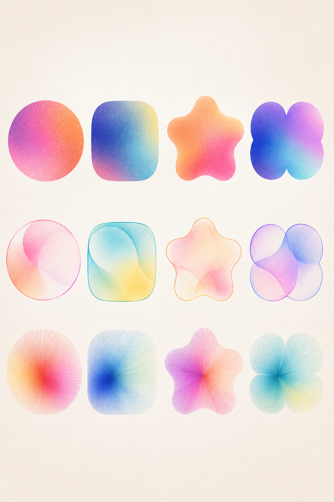

# Shape and Material Capability Specimen V1

## Status and purpose

The user approved this image in conversation on 2026-09-05 as a useful visual
direction for the procedural Day Objects vocabulary.

This is a capability map, not a valid generated day. Its matrix deliberately
shows several geometry and material mechanisms together so they can be compared.
A production scene must follow the daily art-direction, compatibility, and
mutation-budget rules in [`01-generative-dna.md`](01-generative-dna.md).

## Matrix reading

The columns demonstrate related circle-derived carrier regions:

1. circle or low-amplitude radial body;
2. rounded square or superellipse;
3. restrained soft radial star or lobed body;
4. compound body assembled from smoothly joined circular lobes.

The rows demonstrate three broad construction classes:

1. broad smooth color fields spanning a filled carrier;
2. translucent layered membranes with integrated chromatic boundaries;
3. radial fibers that construct the visible silhouette.

The complete material vocabulary remains larger than these three rows. Solid
fields, boundary fields, linework structures, tensioned contour networks, and
repeated harmonic path fields remain separately defined in the DNA contract and
their family references.

## Behaviors to preserve

- Every carrier is recognizably derived from circular geometry.
- Shape mutation and material construction remain separate genes.
- Internal gradients use broad shifted fields without hard cores or eye-like
  spots.
- Membrane layers feel integrated with the carrier rather than pasted on top.
- Radial marks can generate the silhouette instead of merely decorating a
  hidden filled body.
- Color relationships remain clean and saturated without muddy mixtures.
- Stable tactile grain gives different constructions a shared print character.
- Rounded stars and lobes remain abstract and soft rather than literal icons or
  flowers.

## What this image does not authorize

- all visible mechanisms appearing in one generated scene;
- one independently selected style per happening;
- these twelve outcomes becoming fixed reusable actor assets;
- hard centered highlights, pupils, targets, or small gradient stickers;
- point clouds or disconnected particles;
- arbitrary sharp polygons or literal symbols;
- copying the exact specimen palettes as mandatory product palettes.

## Generator interpretation

For one day, select one primary family and freeze a daily art direction. That
direction chooses one dominant geometry region, one dominant material, and at
most one compatible supporting geometry and accent material. Individual actors
then mutate continuously inside that envelope.

The specimen proves that one material grammar can survive across several
related carriers and that one carrier can support several compatible material
grammars. It does not replace family-specific compatibility rules.

