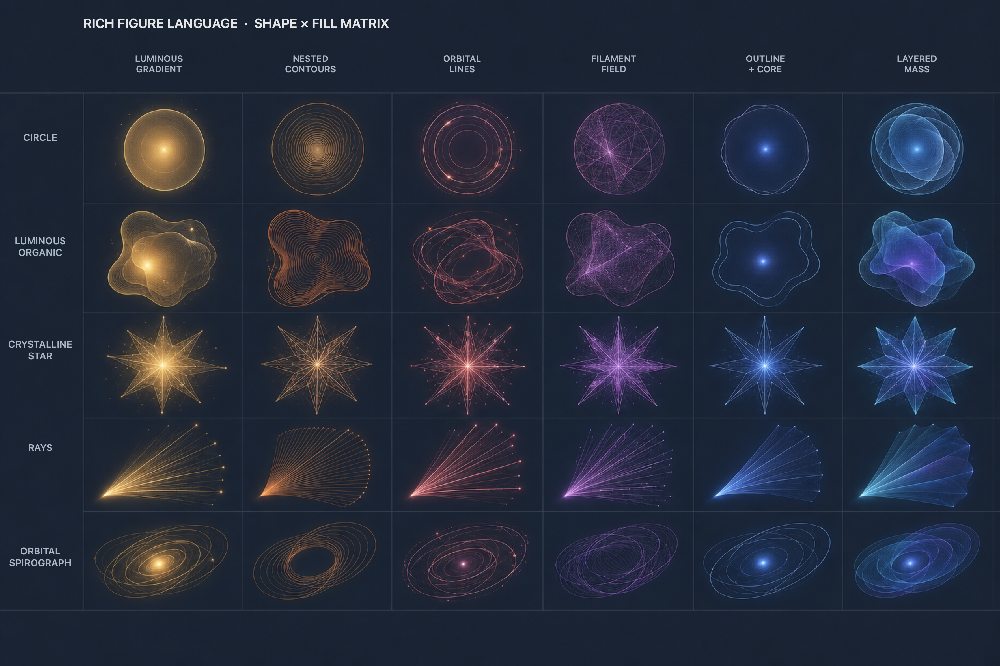

# Rich Figure Language — Shape × Fill Matrix

This board is a visual-direction reference for the proposed rich procedural renderer. It illustrates how five silhouette families could respond to six interior construction strategies while retaining one coherent material language.

Rows: Circle, Luminous Organic, Crystalline Star, Rays, Orbital Spirograph.

Columns: Luminous Gradient, Nested Contours, Orbital Lines, Filament Field, Outline + Core, Layered Translucent Mass.

The matrix is exploratory rather than a requirement to support every shape/fill combination. During implementation, combinations should be filtered by silhouette readability, performance, and behavior at thumbnail size. Colors demonstrate a coherent day palette; the reference does not prescribe these exact hues.

`rich-figure-shape-fill-matrix-v1-unlabeled.png` is retained as the clean source board.
